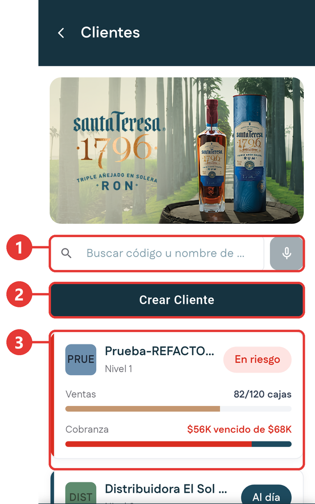
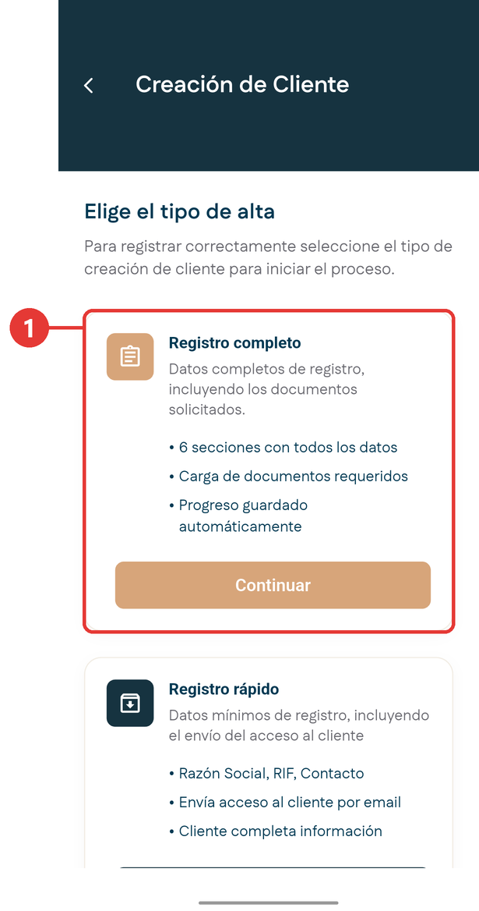
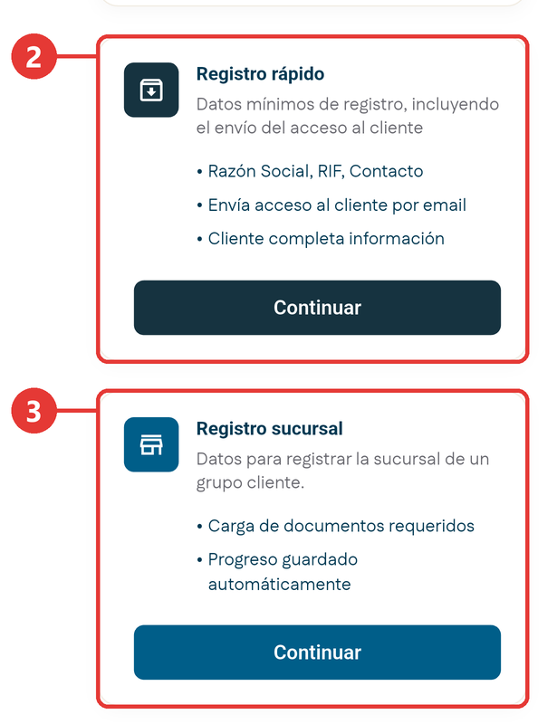
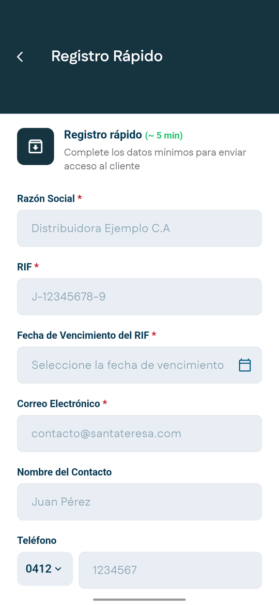
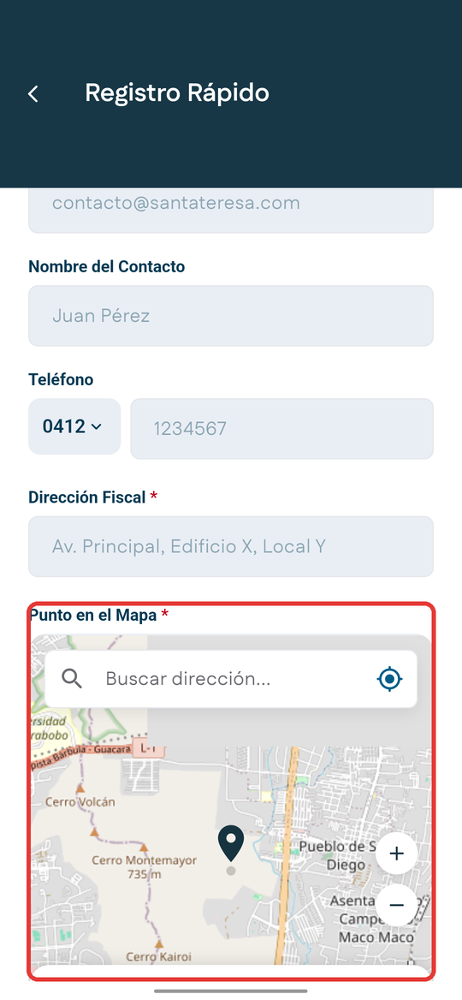
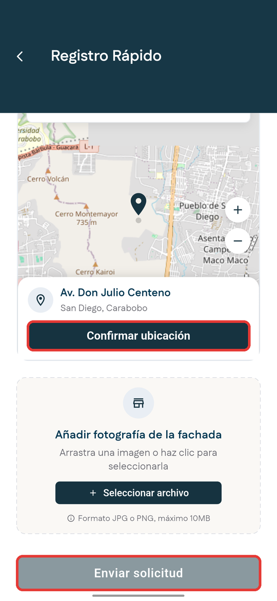
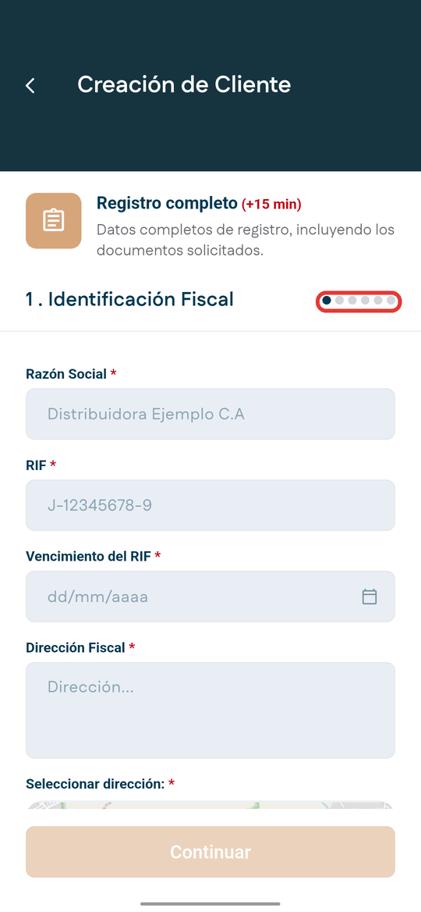
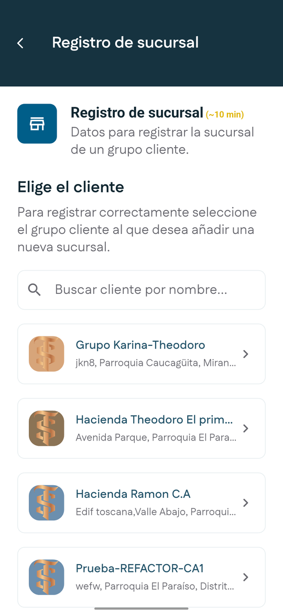

# Clientes

**Para qué sirve:** es el directorio completo de los comercios que tienes asignados y el lugar para dar de alta un cliente nuevo. A diferencia de **Clientes del día** del Inicio, que muestra solo los de tu ruta del día, aquí aparecen todos.

## El directorio

En la barra inferior, toca **Clientes**.

{ .captura }

| # | Qué es |
|:-:|---|
| 1 | **Buscador**: busca por código o nombre, o dicta el nombre con el micrófono. |
| 2 | **Crear Cliente**: da de alta un cliente nuevo. |
| 3 | Las tarjetas de tus clientes. Se leen igual que en el Inicio; mira [Cómo leer una tarjeta de cliente](inicio.md#como-leer-una-tarjeta-de-cliente). Al tocar una se abre la [ficha del cliente](ficha-cliente.md). |

## Las tres formas de dar de alta un cliente

Toca **Crear Cliente**. La aplicación te pide elegir el tipo de alta:

{ .captura }

{ .captura }

| # | Tipo de alta | Tiempo aproximado | Cuándo se usa |
|:-:|---|---|---|
| 1 | **Registro completo** | Más de 15 minutos | El alta formal, con seis secciones de datos y la carga de documentos. |
| 2 | **Registro rápido** | 5 minutos | Solo los datos mínimos. Al enviarlo, el cliente recibe un acceso por correo para completar el resto. |
| 3 | **Registro sucursal** | 10 minutos | Una sede nueva de un grupo que ya es cliente. |

!!! warning "El alta también es una solicitud"
    Dar de alta un cliente no lo crea de inmediato. Se genera una solicitud en estado **Pendiente** que pasa por revisión. Puedes seguirla en [Mis Solicitudes](mis-solicitudes.md), en la categoría **Clientes**.

## Dar de alta un cliente con registro rápido

Es una sola pantalla con los datos mínimos. Los campos con asterisco son obligatorios, y el botón **Enviar solicitud** se activa cuando están todos completos.

1. En **Clientes**, toca **Crear Cliente**.

2. En **Registro rápido**, toca **Continuar**. Se abre **Registro Rápido**.

    { .captura }

3. Escribe la **Razón Social** y el **RIF**, por ejemplo J-40000001-0.

4. Toca **Fecha de Vencimiento del RIF**. Se abre un calendario: elige el día y toca **OK**. La fecha queda escrita como día/mes/año, por ejemplo 30/10/2028.

5. Completa el **Correo Electrónico**. A esa dirección le llega al cliente el acceso para terminar su registro.

6. Completa el **Nombre del Contacto** y el **Teléfono**. Para el teléfono, elige el prefijo a la izquierda, por ejemplo **0412**, y escribe los siete dígitos a la derecha.

    !!! warning "Completa el teléfono"
        Aunque no tiene asterisco, completa el teléfono. La solicitud no se envía sin él.

7. Escribe la **Dirección Fiscal**.

8. En **Punto en el Mapa**, ubica el comercio. Puedes buscar la dirección o tocar **Mi ubicación** para usar tu ubicación actual. Mueve el mapa o usa los botones **+** y **−** hasta que el marcador quede sobre el comercio. La tarjeta de abajo muestra la dirección o las coordenadas del punto.

    { .captura }

9. Toca **Confirmar ubicación**. El botón cambia a **Ubicación confirmada ✓**. Sin este paso no se puede enviar el registro.

    { .captura }

10. Si quieres, añade la **fotografía de la fachada** con **Seleccionar archivo**. Debe estar en formato JPG o PNG y pesar como máximo 10 MB. En el registro rápido es opcional.

11. Toca **Enviar solicitud**.

**Resultado esperado:** aparece la confirmación **¡Cliente Registrado!**, con la razón social y el estado **Pendiente**. Desde ahí tienes dos botones:

- **Ver Solicitud** abre el seguimiento, con sus cuatro pasos: **Solicitud creada**, revisión por el supervisor de ventas, revisión por contraloría y **Solicitud Cerrada**.
- **Regresar al home** te lleva al Inicio.

El cliente nuevo no aparece todavía en la lista de **Clientes**, porque primero es una solicitud. También puedes seguirla desde la ficha de cualquier cliente: toca **Histórico de Solicitudes** y luego **Revisar** en la tarjeta **Clientes**.

## Dar de alta un cliente con registro completo

El registro completo tiene seis secciones. Arriba queda fijo el encabezado **Registro completo**, y abajo, el botón **Continuar**. Los campos se deslizan entre los dos.

1. En **Clientes**, toca **Crear Cliente**.

2. En **Registro completo**, toca **Continuar**. Reserva al menos 15 minutos.

    { .captura }

    Los puntos de arriba a la derecha te indican en qué sección vas.

3. Completa la sección **1. Identificación Fiscal**:
    - **Razón Social**.
    - **RIF**, por ejemplo J-12345678-9. Si el formato no es válido, la aplicación te lo avisa debajo del campo.
    - **Vencimiento del RIF**: elige la fecha en el calendario y toca **OK**. Si prefieres escribirla, toca el lápiz del calendario.
    - **Dirección Fiscal**.
    - **Seleccionar dirección**: ubica el comercio en el mapa igual que en el registro rápido y toca **Confirmar ubicación**. La primera vez que tocas **Mi ubicación**, el teléfono te pide permiso para usar tu ubicación; acéptalo.
    - **Estado** y **Ciudad**.
    - Si los tienes, el **Código Postal** y un **Punto de Referencia**.
    - El **Teléfono del Cliente**, con su prefijo, y el **Correo del Cliente**.
    - Si quieres, la **fotografía de la fachada**, en JPG o PNG y de máximo 10 MB.

    Si dejas vacío un campo obligatorio, aparece **Este campo es requerido** debajo de él.

4. Toca **Continuar**. El botón se activa cuando están completos todos los campos marcados con asterisco rojo.

5. Completa la sección **2. Contacto**. Tiene tres grupos que se abren al tocarlos: **Encargado de Compras**, **Encargado de Pagos** y **Encargado de Recepción de Mercancía**. En cada uno:
    1. Escribe el **Nombre** y el **Apellido**.
    2. Elige el **Tipo** de documento y escribe el **N° Identificación**.
    3. Escribe el **Teléfono**, con su prefijo, y el **Correo**.
    4. Toca **Guardar datos**. El botón cambia a **✓ Guardado** y el grupo indica **1 creado**.

    Cuando termines, toca **Continuar**.

6. En la sección **3. Operación**, configura los horarios de atención del comercio y toca **Continuar**.

    <!-- PENDIENTE: pasos reales de la sección 3, Operación. -->

7. Completa las secciones 4 a 6, hasta la carga de los documentos de respaldo.

    <!-- PENDIENTE: nombres y pasos reales de las secciones 4 a 6. -->

8. Al terminar, el alta entra como solicitud y pasa por revisión.

    <!-- PENDIENTE: pantalla de confirmación del registro completo. -->

Para corregir algo de una sección anterior, toca la **flecha** de arriba a la izquierda. Vuelves a esa sección con tus datos tal como los dejaste.

## Registrar una sucursal

<!-- PENDIENTE: pasos reales del registro de sucursal, desde la elección del grupo cliente hasta la confirmación. -->

1. En **Clientes**, toca **Crear Cliente**.

2. En **Registro sucursal**, toca **Continuar**.

    { .captura }

3. Elige el grupo cliente al que pertenece la nueva sede. Puedes buscarlo por nombre.

4. Completa los datos de la sucursal. Puede tener un RIF distinto al de la casa matriz.

5. Adjunta los documentos requeridos y envía.

## Si no tienes conexión

Puedes consultar tus clientes y dar de alta uno nuevo aunque no tengas señal.

- En la pantalla **Clientes** aparece abajo una franja roja que avisa que no hay conexión y que estás viendo los clientes guardados en el teléfono. El botón **Reintentar** vuelve a buscar la señal. Para quitar la franja, deslízala hacia abajo.
- El mapa puede verse gris, sin calles. Aun así puedes moverlo, usar **Mi ubicación** y confirmar la ubicación.
- Al tocar **Enviar solicitud**, la solicitud se guarda en el teléfono y se envía sola cuando vuelve la señal.

<!-- PENDIENTE: cómo funcionan sin conexión la sección Operación del registro completo y el registro de sucursal. -->
