# Cobranzas

**Para qué sirve:** aquí administras tu cartera por cobrar y registras los pagos que recibes de tus clientes. Todo cálculo usa dos monedas y dos tasas de cambio, así que conviene leer antes [La tasa de cambio](../primeros-pasos/antes-de-empezar.md#la-tasa-de-cambio).

!!! tip "Documento es lo mismo que factura"
    En esta sección, **documento** significa **factura**. Es el nombre que se usa en el área administrativa.

## La vista de cartera

Entra por la barra inferior tocando **Cobranzas**, o desde el Inicio con el botón **Revisar** de Cobros pendientes. Antes de elegir un cliente, ves el panorama completo:

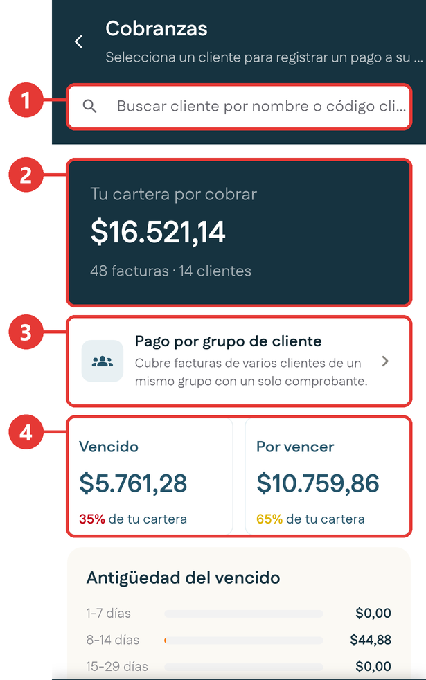{ .captura }

| # | Qué es | Qué te dice |
|:-:|---|---|
| 1 | **Buscador** | Busca un cliente por nombre o código. |
| 2 | **Tu cartera por cobrar** | El monto total pendiente, con la cantidad de facturas y de clientes. |
| 3 | **Pago por grupo de cliente** | Cubre facturas de varios clientes de un mismo grupo con un solo comprobante. |
| 4 | **Vencido y Por vencer** | El total dividido en dos, con el porcentaje de tu cartera que representa cada parte. |

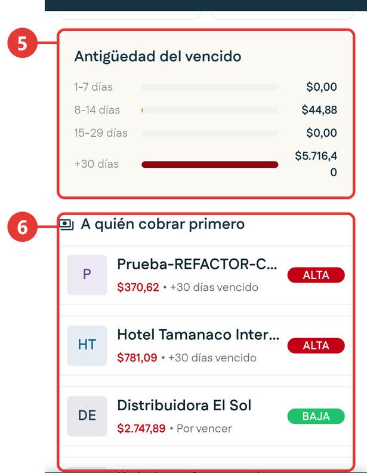{ .captura }

| # | Qué es | Qué te dice |
|:-:|---|---|
| 5 | **Antigüedad del vencido** | La deuda vencida repartida por tramos de días: de 1 a 7, de 8 a 14, de 15 a 29 y más de 30. Mientras más antigua, más difícil de recuperar. |
| 6 | **A quién cobrar primero** | Tus clientes ordenados por prioridad, con distintivo **ALTA**, **MEDIA** o **BAJA**. La prioridad se calcula por los días de vencimiento, no por el monto. |

## Elegir el cliente y la forma de pago

1. Busca el cliente por nombre o código, o tócalo en la lista **A quién cobrar primero**.

2. Se abre **Registrar Pago** con el resumen del cliente:

    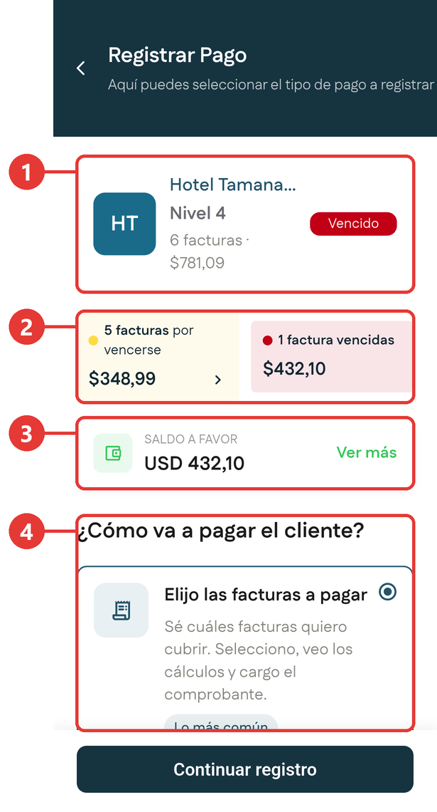{ .captura }

    | # | Qué es |
    |:-:|---|
    | 1 | El cliente, su nivel, cuántas facturas tiene y su estado. |
    | 2 | Facturas por vencer y facturas vencidas, con sus montos. |
    | 3 | **Saldo a favor** del cliente. Toca **Ver más** para usarlo en este pago. |
    | 4 | **¿Cómo va a pagar el cliente?**: aquí eliges la forma de registrar el pago. |

3. Elige una de las tres formas de pago y toca **Continuar registro**:

| Forma de pago | Cuándo se usa | Qué hace la aplicación |
|---|---|---|
| **Elijo las facturas a pagar** | El cliente indica exactamente qué facturas quiere cubrir. Es la más común. | Aplica el pago solo a las facturas que marques. |
| **Abono automático a documentos** | El cliente entrega un monto libre, sin decir qué facturas cubre. | Reparte el monto empezando por la factura más vencida. Lo que no alcanza queda como pago parcial. |
| **Abono a Billetera** | El cliente adelanta dinero para usarlo después. | Suma el monto al saldo a favor del cliente, sin tocar ninguna factura. |

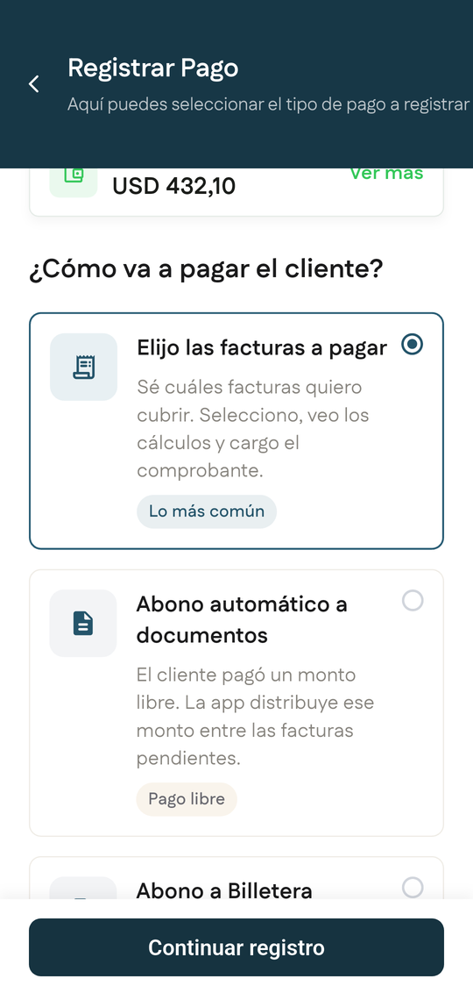{ .captura }

## Registrar un pago eligiendo las facturas

El indicador de arriba muestra tres pasos: **Elige**, **Cálculo** y **Comprobantes**. Después del tercero aparece una última pantalla, **Confirmar registro**, que es donde el pago se registra de verdad.

### Paso 1: Elige

1. En **Registrar Pago**, deja marcada **Elijo las facturas a pagar** y toca **Continuar registro**.

    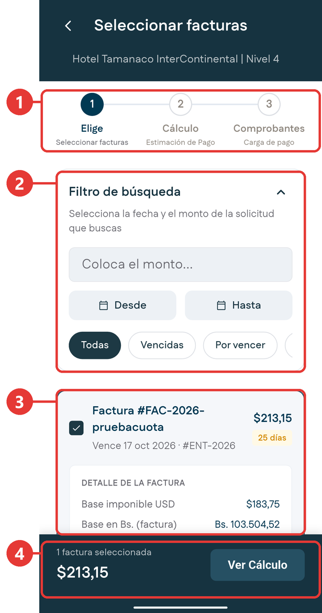{ .captura }

    | # | Qué es |
    |:-:|---|
    | 1 | Los pasos del registro. |
    | 2 | **Filtro de búsqueda**: por monto, por rango de fechas con **Desde** y **Hasta**, o por estado: **Todas**, **Vencidas**, **Por vencer** y **Pagadas**. |
    | 3 | Cada factura, con su casilla para marcarla, su monto y el detalle de la factura. |
    | 4 | Cuántas facturas marcaste, el total y el botón **Ver Cálculo**. |

2. Marca las facturas que el cliente va a pagar.
3. Toca **Ver Cálculo**.

### Paso 2: Cálculo

4. Revisa el cálculo del pago:

    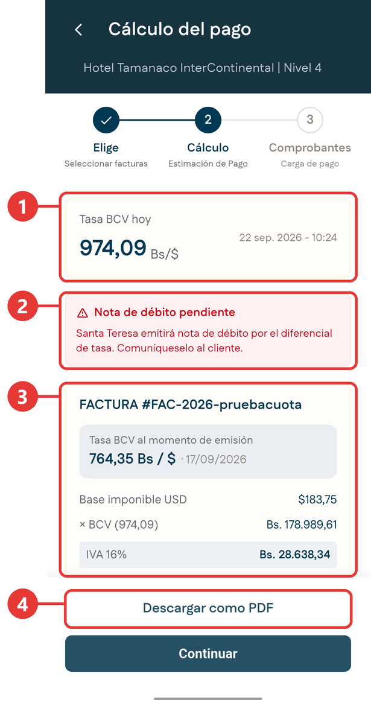{ .captura }

    | # | Qué es |
    |:-:|---|
    | 1 | **Tasa BCV hoy**, con la fecha y la hora. |
    | 2 | **Nota de débito pendiente**: aparece cuando la tasa cambió desde que se emitió la factura. Santa Teresa emitirá una nota de débito por la diferencia; comunícaselo al cliente. |
    | 3 | Cada factura con la **tasa BCV del día en que se emitió**, la base imponible, el IVA y el impuesto LISAEA. |
    | 4 | **Descargar como PDF**: genera el detalle del cálculo por si el cliente lo pide. |

    Al final de cada factura verás el **Total factura** en dólares y en bolívares.

    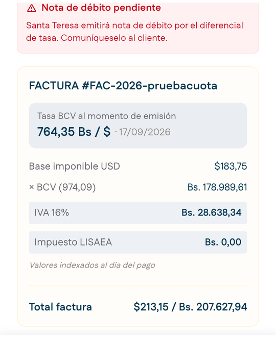{ .captura }

    Según el nivel del cliente, pueden aparecer opciones de pago distintas, por ejemplo **Pago completo** o **Solo IVA**.

5. Toca **Continuar**.

### Paso 3: Comprobantes

6. Elige el **método de pago** arriba a la derecha del comprobante: transferencia bancaria, pago móvil o efectivo en dólares.

    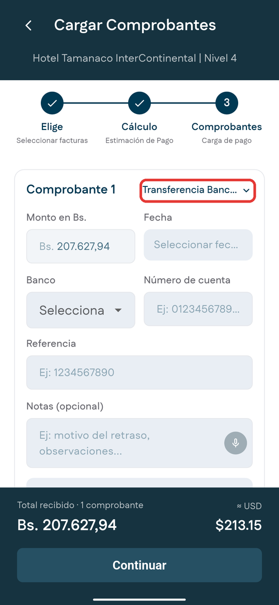{ .captura }

7. Completa los datos del comprobante:

    | Campo | Qué se llena |
    |---|---|
    | **Monto en Bs.** | Viene con el total calculado. Puedes cambiarlo para registrar un pago parcial. |
    | **Fecha** | La fecha del pago. Solo se permiten hoy o días anteriores. |
    | **Banco** | El banco de la operación. |
    | **Número de cuenta** y **Referencia** | Los datos de la operación bancaria. |
    | **Notas** | Opcional, para dejar constancia de algo puntual. También puedes dictarlas con el micrófono. |

8. Adjunta el soporte del pago:

    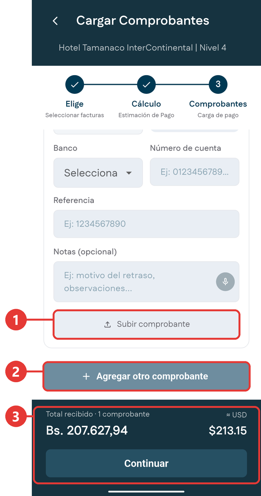{ .captura }

    | # | Qué es |
    |:-:|---|
    | 1 | **Subir comprobante**: toma una foto con la cámara, elige una imagen de la galería o sube un documento PDF. |
    | 2 | **Agregar otro comprobante**: úsalo si el cliente pagó en varias operaciones. Cada comprobante tiene sus propios datos. |
    | 3 | **Total recibido**: suma todos los comprobantes, en bolívares y en dólares. Toca **Continuar** para seguir. |

### Paso 4: Confirmar registro

9. Revisa el resumen: cliente y nivel, cantidad de comprobantes, total, facturas cubiertas y fecha. Aquí también puedes **Compartir comprobante**.
10. Toca **Registrar pago**.

!!! warning "El pago no está registrado hasta el último paso"
    Mientras no toques **Registrar pago** en la pantalla **Confirmar registro**, el pago no queda registrado.

## Usar el saldo a favor en un pago

Si el cliente tiene saldo a favor, puedes aplicarlo al pago.

1. En **Registrar Pago**, toca **Ver más** en la tarjeta **Saldo a favor**.
2. Se abre **Usar saldo a favor**, con el saldo disponible y su desglose:

    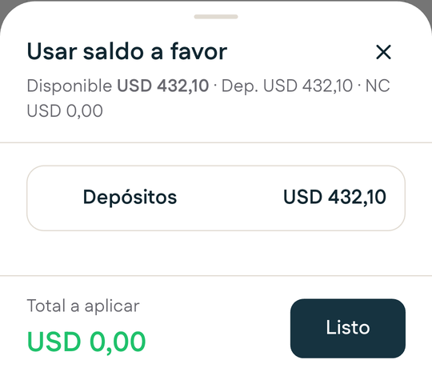{ .captura }

    - Los **depósitos** aparecen agrupados en una sola línea.
    - Cada **nota de crédito** aparece por separado, con su número y su motivo.

3. Marca lo que quieres aplicar. Abajo, **Total a aplicar** va sumando lo que marcaste.
4. Toca **Listo**.

!!! tip "Consejo"
    Como cada nota de crédito se marca por separado, puedes aplicar solo la que corresponde a un reclamo concreto sin tocar el resto del saldo del cliente.

## Registrar un abono automático

1. En **Registrar Pago**, elige **Abono automático a documentos** y toca **Continuar registro**.

    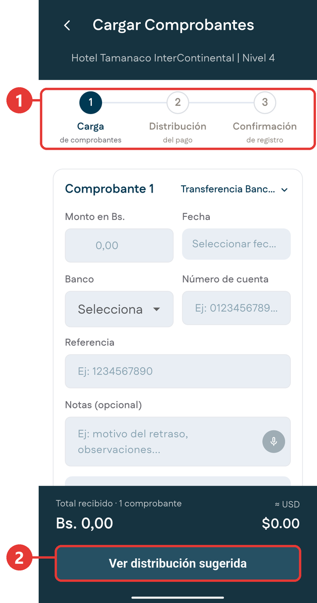{ .captura }

    | # | Qué es |
    |:-:|---|
    | 1 | Los pasos: **Carga de comprobantes**, **Distribución del pago** y **Confirmación de registro**. |
    | 2 | **Ver distribución sugerida**: muestra cómo se reparte el monto. |

2. Se abre **Cargar Comprobantes**. Completa el **Comprobante 1** con el monto que entregó el cliente. No se eligen facturas.

    | Campo | Qué se llena |
    |---|---|
    | **Seleccionar método de pago** | El método de la operación. Es obligatorio para ver la distribución. |
    | **Monto en Bs.** | Escribe solo los dígitos, sin coma: la aplicación pone los decimales. Por ejemplo, 10000 queda como **100,00**. |
    | **Fecha** | Viene con la fecha de hoy. |
    | **Notas (opcional)** | Para dejar constancia de algo puntual. También puedes dictarlas con el micrófono. |
    | **Subir comprobante** | El soporte del pago. |

    Abajo, **Total recibido** muestra el monto en bolívares y su equivalente en dólares.

3. Toca **Ver distribución sugerida**. La aplicación muestra qué facturas quedan cubiertas y cuál queda con pago parcial, empezando siempre por la más vencida. Si no elegiste el método de pago, te avisa con **Por favor seleccione el método de pago del Comprobante 1.**
4. Confirma el registro.

    <!-- PENDIENTE: lista de métodos de pago, pantalla Distribución del pago y pantalla Confirmación de registro del abono automático. -->

## Abonar a la billetera del cliente

### Ver la billetera

1. En **Registrar Pago**, elige **Abono a Billetera** y toca **Continuar registro**.

2. Se abre la **Billetera del cliente**:

    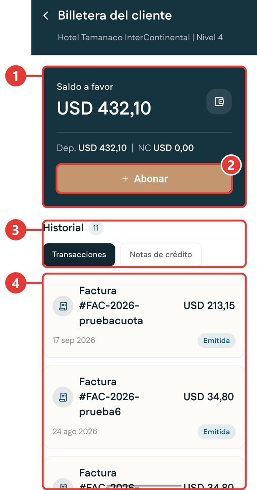{ .captura }

    | # | Qué es |
    |:-:|---|
    | 1 | **Saldo a favor** total, con su desglose: depósitos y notas de crédito. |
    | 2 | **Abonar**: registra un ingreso nuevo a la billetera. |
    | 3 | **Historial**, en dos pestañas: **Transacciones** y **Notas de crédito**. |
    | 4 | Los movimientos, cada uno con su monto, su fecha y su estado. Si el cliente no tiene ninguno, dice **Sin movimientos para mostrar.** |

### Registrar el abono

3. Toca **Abonar**.

    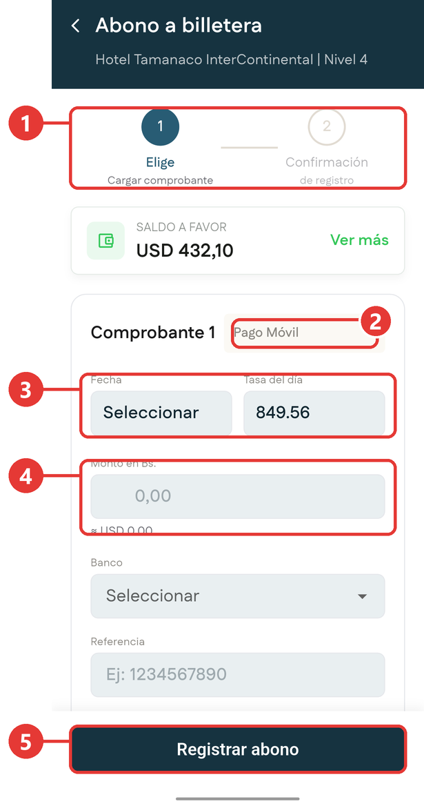{ .captura }

    | # | Qué es |
    |:-:|---|
    | 1 | Los pasos: **Elige** y **Confirmación de registro**. |
    | 2 | El método del comprobante, por ejemplo **Pago Móvil**. |
    | 3 | **Fecha** del pago y la **Tasa del día** que se va a usar. |
    | 4 | **Monto en Bs.** Debajo aparece al instante su equivalente en dólares. |
    | 5 | **Registrar abono**. |

4. Elige el método del comprobante y la **Fecha**.
5. Escribe el **Monto en Bs.**
6. Elige el **Banco** y escribe la **Referencia**.

    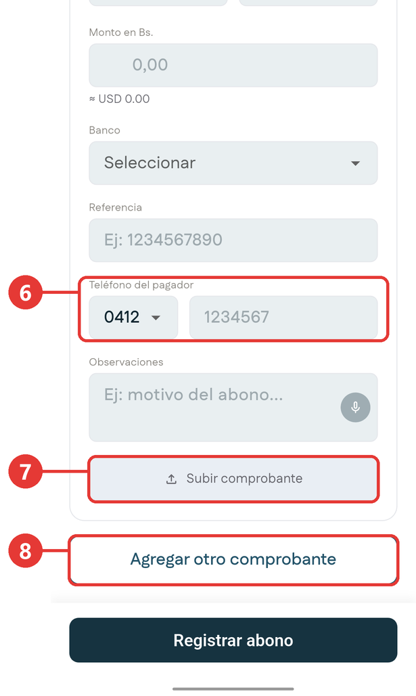{ .captura }

    | # | Qué es |
    |:-:|---|
    | 6 | **Teléfono del pagador**: aparece cuando el método es pago móvil. |
    | 7 | **Subir comprobante**. |
    | 8 | **Agregar otro comprobante**, si el cliente abonó en varias operaciones. |

7. Si quieres, agrega **Observaciones** y adjunta el comprobante.
8. Toca **Registrar abono**.

**Resultado esperado:** aparece la confirmación **¡Abono Registrado!** con el resumen y la opción **Compartir comprobante** para enviárselo al cliente.

## Cobrar a un grupo de clientes

Con esta opción cubres facturas de varias sucursales de un mismo grupo empresarial con un solo comprobante.

1. En la vista de cartera, toca **Pago por grupo de cliente**.
2. Elige el grupo. Si no aparece, búscalo por nombre.

    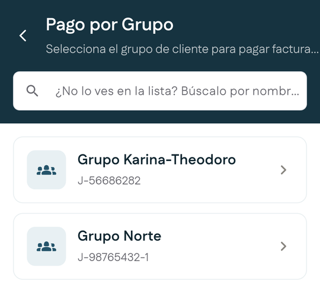{ .captura }

3. Marca las facturas que se van a cubrir:

    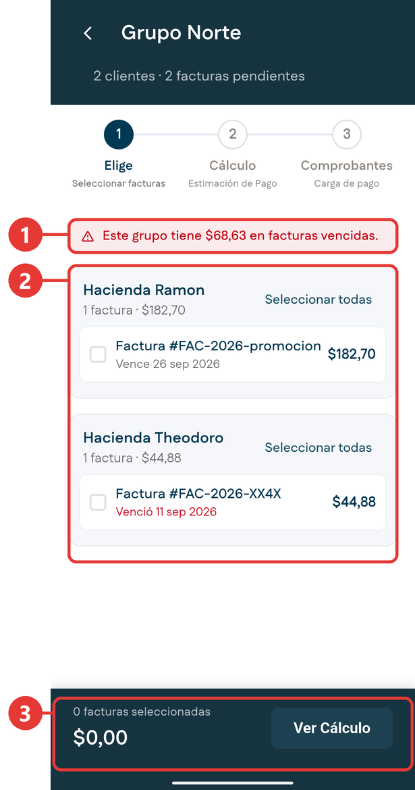{ .captura }

    | # | Qué es |
    |:-:|---|
    | 1 | Aviso con el total vencido del grupo. |
    | 2 | Las facturas agrupadas por cliente. **Seleccionar todas** marca todas las facturas de ese cliente. |
    | 3 | Cuántas facturas marcaste, el total y el botón **Ver Cálculo**. |

4. Toca **Ver Cálculo** y sigue el mismo proceso de [registrar un pago](#registrar-un-pago-eligiendo-las-facturas) desde el paso 2.

## Qué significan los estados de un pago

Que un pago se registre en la aplicación no significa que el banco ya lo confirmó. Después corre una **conciliación bancaria**: el sistema verifica con el banco que el monto, la fecha y la referencia coinciden con una operación real.

- Con algunos bancos la confirmación es casi inmediata. Con otros puede tardar varias horas.
- Si no se confirma al primer intento, el sistema vuelve a intentarlo solo durante un tiempo. Si sigue sin confirmarse, el caso pasa a revisión manual.
- Un pago que finalmente no se confirma queda señalado. No lo des por cobrado frente al cliente.

Estos estados son los que ves en el historial de la billetera y en el [Histórico de Cobranzas](historicos.md#historico-de-cobranzas).

Para abrir el Histórico de Cobranzas, en el Inicio toca el menú de arriba a la derecha y luego **Historico de Cobranzas**.

## Si no tienes conexión

Puedes consultar tu cartera aunque no tengas señal.

- Al entrar a **Cobranzas** aparece arriba un aviso amarillo que indica que no hay conexión y que estás viendo la última consulta guardada. Ves **Tu cartera por cobrar**, **Vencido**, **Por vencer**, **Antigüedad del vencido** y **A quién cobrar primero** tal como estaban en esa consulta.
- **Pago por grupo de cliente** se puede consultar sin señal si antes lo abriste una vez con conexión.
- Lo que registres sin conexión se guarda en el teléfono y se envía solo cuando vuelve la señal.

<!-- PENDIENTE: pasos reales para registrar un pago, un abono automático y un abono a billetera sin conexión, y cómo se ven el buscador y el Histórico de Cobranzas sin señal. -->
