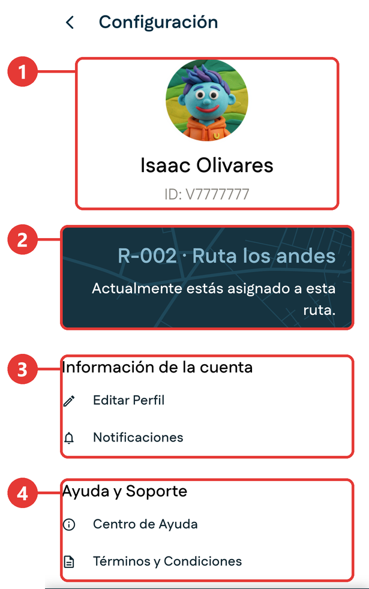

# Configuración

**Para qué sirve:** aquí están los datos de tu cuenta, tus notificaciones y la ayuda.

Para entrar, abre el [menú lateral](../primeros-pasos/navegacion.md#el-menu-lateral) y toca **Configuración**.

{ .captura }

| # | Qué es | Para qué sirve |
|:-:|---|---|
| 1 | **Tu perfil** | Tu foto, tu nombre y tu número de identificación. |
| 2 | **Tu ruta** | La ruta a la que estás asignado. |
| 3 | **Información de la cuenta** | **Editar Perfil** para cambiar tus datos y **Notificaciones** para elegir las alertas que recibes. |
| 4 | **Ayuda y Soporte** | **Centro de Ayuda** y **Términos y Condiciones**. |

## Cerrar sesión

1. Abre **Configuración** y desliza el dedo hacia arriba.
2. Toca **Cerrar Sesión**, en rojo, al final de la pantalla.

También puedes cerrar sesión desde el final del [menú lateral](../primeros-pasos/navegacion.md#el-menu-lateral).

Antes de hacerlo, revisa los avisos de [Inicio de sesión](../primeros-pasos/inicio-de-sesion.md#cerrar-sesion).
