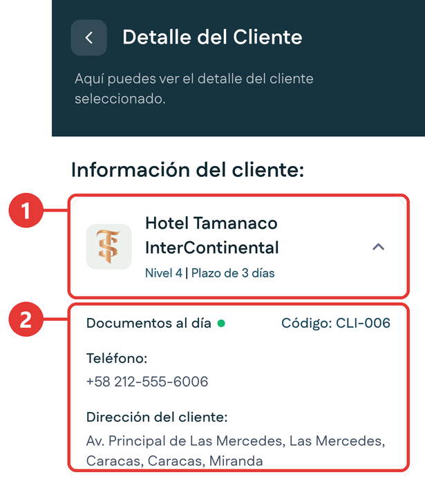
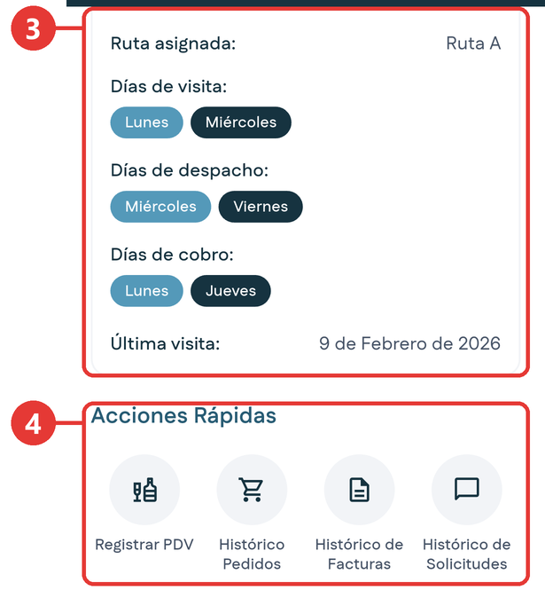
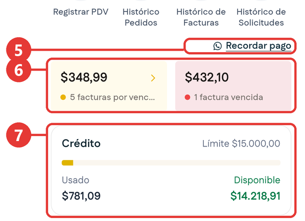
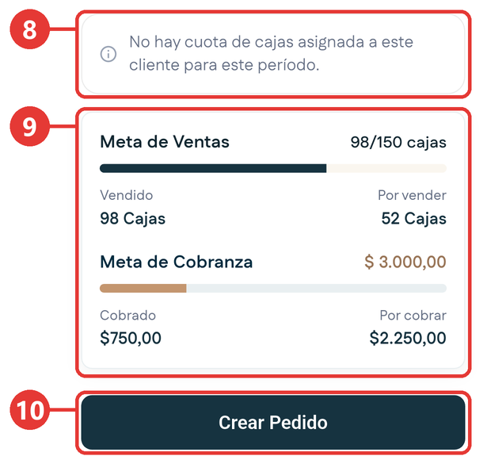
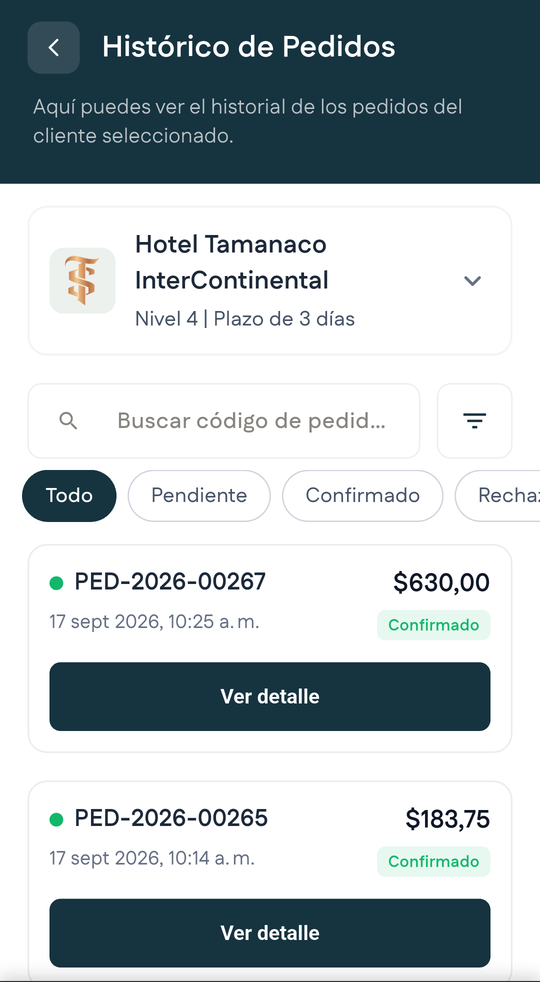
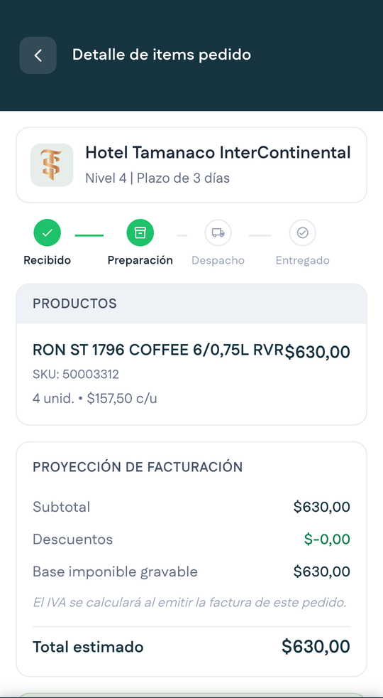
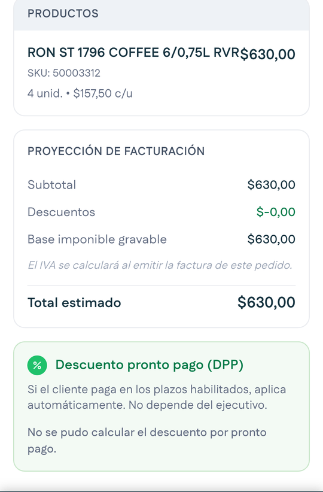
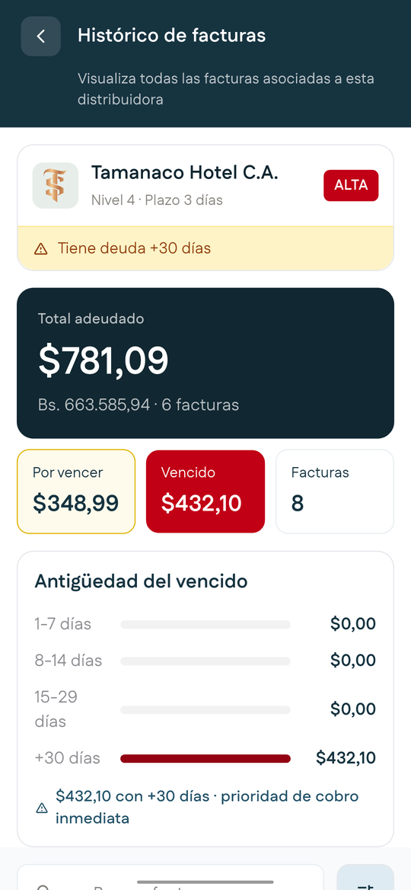
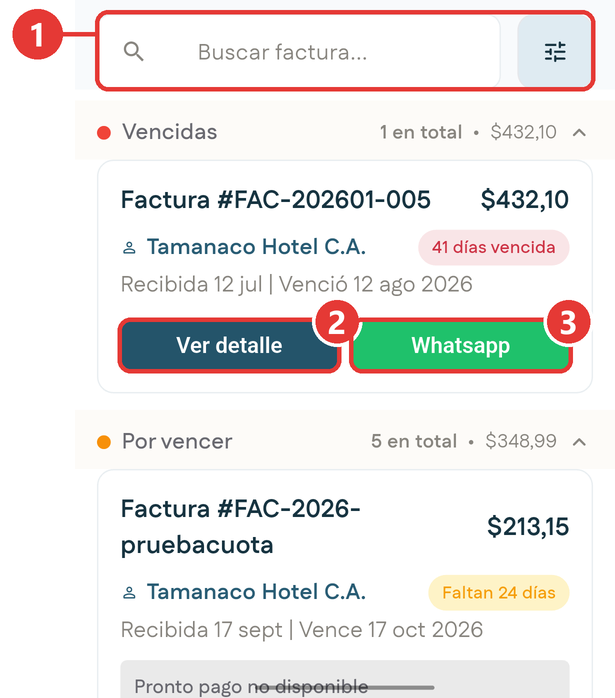

# Ficha del cliente

**Para qué sirve:** la ficha es la pantalla más importante de la aplicación. Reúne en un solo lugar los datos de contacto del cliente, la logística de la visita, su situación financiera y sus metas. Desde aquí lanzas el resto de las operaciones.

En la aplicación se llama **Detalle del Cliente**. Se abre al tocar un cliente en cualquier lista, por ejemplo en **Clientes del día** del [Inicio](inicio.md) o en el directorio de [Clientes](clientes.md).

## Las partes de la ficha

La ficha es larga. Desliza el dedo hacia arriba para recorrerla.

### Datos del cliente

Toca la tarjeta con el nombre del cliente para desplegar sus datos completos.

{ .captura }

| # | Qué es | Qué te dice |
|:-:|---|---|
| 1 | **Nombre, nivel y plazo** | El nombre del comercio, su [nivel](../primeros-pasos/antes-de-empezar.md#niveles-de-cliente) y el plazo de pago que tiene concedido. La flecha despliega o recoge los datos. |
| 2 | **Datos de contacto** | Si sus documentos están al día, su código, su teléfono y su dirección. |

### Rutas y acciones

{ .captura }

| # | Qué es | Qué te dice |
|:-:|---|---|
| 3 | **Rutas & Visitas** | La ruta asignada, los días de visita, de despacho y de cobro, y la fecha de la última visita. |
| 4 | **Acciones Rápidas** | **Registrar PDV**, **Histórico Pedidos**, **Histórico de Facturas** e **Histórico de Solicitudes**. |

Los tres tipos de día no son lo mismo:

| Día | Qué indica |
|---|---|
| **Días de visita** | Cuándo debes presentarte en el comercio. |
| **Días de despacho** | Cuándo el comercio recibe mercancía. |
| **Días de cobro** | Cuándo el comercio atiende pagos a proveedores. |

### Situación financiera

{ .captura }

| # | Qué es | Qué te dice |
|:-:|---|---|
| 5 | **Recordar pago** | Abre WhatsApp con un recordatorio de pago para el cliente. |
| 6 | **Facturas** | A la izquierda, las facturas por vencer y su monto. A la derecha, las facturas vencidas y su monto. Al tocarlas vas a [Cobranzas](cobranzas.md). |
| 7 | **Crédito** | El límite de crédito del cliente, cuánto tiene usado y cuánto le queda disponible. |

### Metas y pedido

{ .captura }

| # | Qué es | Qué te dice |
|:-:|---|---|
| 8 | **Cuota de cajas** | La cuota de cajas asignada al cliente en el período. Si no tiene, aparece un aviso. |
| 9 | **Metas** | **Meta de Ventas** en cajas y **Meta de Cobranza** en dólares, cada una con su barra de avance, lo logrado y lo que falta. |
| 10 | **Crear Pedido** | Abre el asistente de [Pedidos](pedidos.md). |

!!! tip "Meta de ventas y cuota no son lo mismo"
    La **Meta de Ventas** es un pedido sugerido, calculado según el historial de compra del cliente, para orientar cuánto debería pedir en el período. La **cuota de cajas** es otro dato, aparte.

## Preparar una visita a un cliente

1. Desde el Inicio, toca el cliente en la lista **Clientes del día**.
2. Toca la tarjeta con el nombre del cliente para desplegar sus datos completos.
3. Revisa **Rutas & Visitas** para confirmar que hoy corresponde visita, y fíjate si además es día de cobro.
4. Revisa las dos tarjetas de facturas: por vencer y vencidas. El monto vencido te indica qué tan urgente es el cobro.
5. Desliza hasta el final para ver la **Meta de Ventas** y la **Meta de Cobranza** del cliente.
6. Desde aquí lanza la operación que corresponda: **Registrar PDV** para revisar el anaquel, o **Crear Pedido** para levantar la orden.

## Consultar los pedidos del cliente

1. En la ficha, toca **Histórico Pedidos**.

    { .captura }

2. Busca un pedido por su código, o filtra por estado: **Todo**, **Pendiente**, **Confirmado** o **Rechazado**.
3. Toca **Ver detalle** en el pedido que quieres revisar.

**Resultado esperado:** ves el detalle del pedido, con su avance, sus productos y su proyección de facturación.

{ .captura }

El avance del pedido tiene cuatro etapas: **Recibido**, **Preparación**, **Despacho** y **Entregado**. Las etapas completadas aparecen en verde.

Más abajo verás el recuadro del **Descuento pronto pago**. Aprende qué es en [Pedidos](pedidos.md#impuestos-y-descuentos).

{ .captura }

## Consultar las facturas del cliente

1. En la ficha, toca **Histórico de Facturas**.

    { .captura }

    Arriba ves el resumen: el total adeudado en dólares y en bolívares, lo que está por vencer, lo vencido y la antigüedad de lo vencido.

2. Desliza hacia abajo para ver la lista de facturas, agrupadas en **Vencidas** y **Por vencer**.

    { .captura }

| # | Qué es |
|:-:|---|
| 1 | Buscador de facturas y botón de filtros. |
| 2 | **Ver detalle**: abre la factura. |
| 3 | **Whatsapp**: envía la información de la factura al cliente por WhatsApp. |

## Consultar las solicitudes del cliente

En la ficha, toca **Histórico de Solicitudes**. Se abre [Mis Solicitudes](mis-solicitudes.md).

## A dónde puedes ir desde aquí

| Si tocas | Vas a |
|---|---|
| **Registrar PDV** | [Punto de Venta](punto-de-venta.md), con este cliente ya seleccionado. |
| **Crear Pedido** | [Pedidos](pedidos.md). |
| Las tarjetas de facturas | [Cobranzas](cobranzas.md). |
| **Histórico de Solicitudes** | [Mis Solicitudes](mis-solicitudes.md). |
