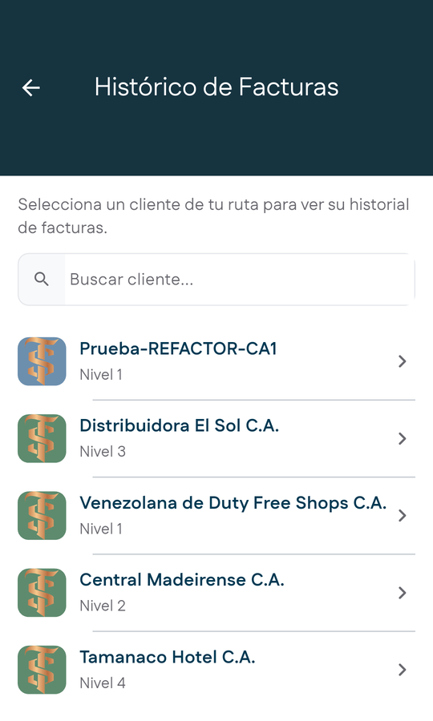
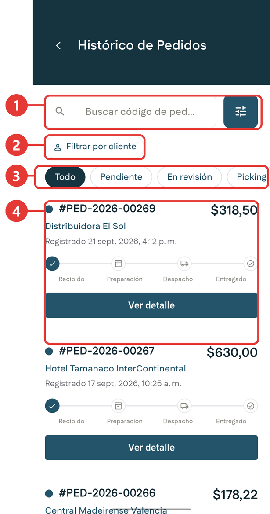
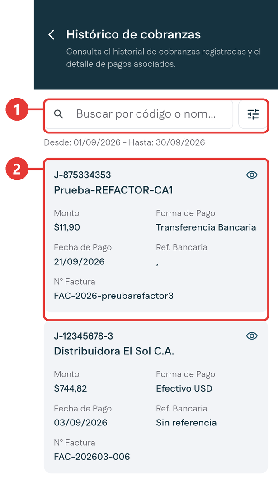

# Históricos

**Para qué sirven:** son tres pantallas de consulta para buscar qué pasó con una factura, un pedido o un cobro. Se abren desde el [menú lateral](../primeros-pasos/navegacion.md#el-menu-lateral).

| Pantalla | Qué consultas |
|---|---|
| **Histórico de facturas** | Las facturas de un cliente de tu ruta. |
| **Histórico de Pedidos** | Todos tus pedidos, con su estado y su avance. |
| **Histórico de Cobranzas** | Los cobros registrados y el detalle de sus pagos. |

!!! tip "Históricos del menú y de la ficha"
    Los históricos del menú cubren toda tu cartera. En la [ficha del cliente](ficha-cliente.md) también hay históricos, pero solo de ese cliente. Si buscas algo de un cliente en particular, suele ser más rápido entrar por su ficha.

## Histórico de facturas

1. Abre el menú lateral y toca **Histórico de facturas**.

2. Elige el cliente. Puedes buscarlo por nombre.

    { .captura }

3. Se abren las facturas de ese cliente: el resumen de su deuda y la lista de facturas vencidas y por vencer. Se leen igual que en la ficha; mira [Consultar las facturas del cliente](ficha-cliente.md#consultar-las-facturas-del-cliente).

## Histórico de Pedidos

1. Abre el menú lateral y toca **Histórico de Pedidos**.

    { .captura }

    | # | Qué es |
    |:-:|---|
    | 1 | Buscador por código de pedido y botón de filtros. |
    | 2 | **Filtrar por cliente**. |
    | 3 | Filtros por estado: **Todo**, **Pendiente**, **En revisión**, **Picking**, **En camino** y **Entregado**. Desliza de lado para ver todos. |
    | 4 | Cada pedido, con su código, el cliente, la fecha, el monto y su avance: **Recibido**, **Preparación**, **Despacho** y **Entregado**. |

2. Toca **Ver detalle** en el pedido que quieres revisar.

Lee qué significa cada estado en [Pedidos](pedidos.md#los-estados-de-un-pedido).

## Histórico de Cobranzas

1. Abre el menú lateral y toca **Histórico de Cobranzas**.

    { .captura }

    | # | Qué es |
    |:-:|---|
    | 1 | Buscador por código o nombre del cliente, y botón de filtros. |
    | 2 | Cada cobro, con el cliente, el monto, la forma de pago, la fecha, la referencia bancaria y la factura. |

2. Debajo del buscador verás el rango de fechas activo. Por defecto es el mes en curso.
3. Para cambiarlo, toca el botón de filtros, a la derecha del buscador, y ajusta las fechas.
4. Si buscas un cobro concreto, escribe el código o el nombre del cliente en el buscador.
5. Toca el ícono del **ojo** en un cobro para ver el detalle del recibo y sus pagos.
