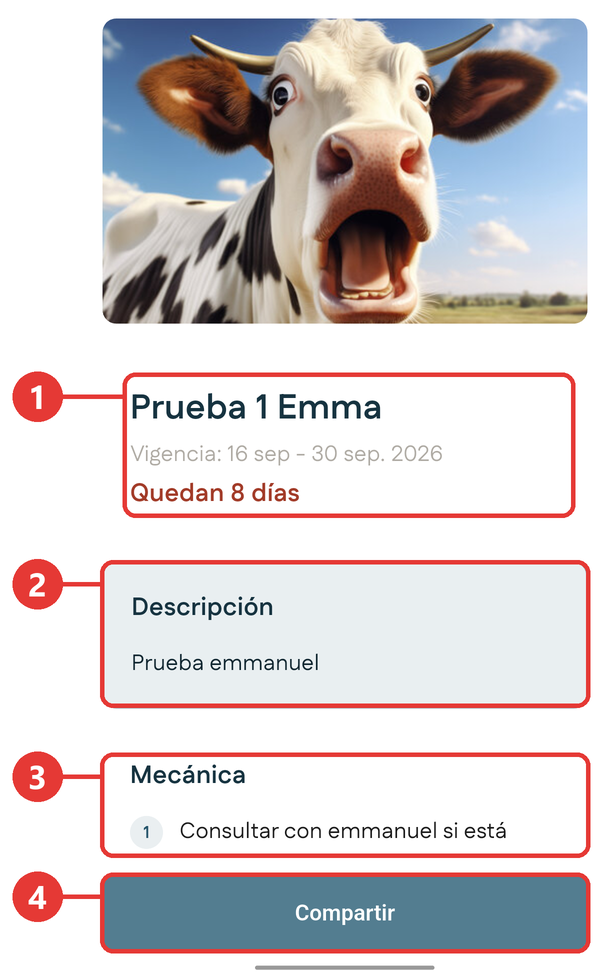
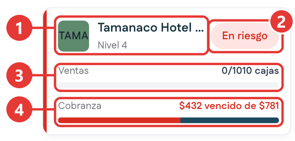
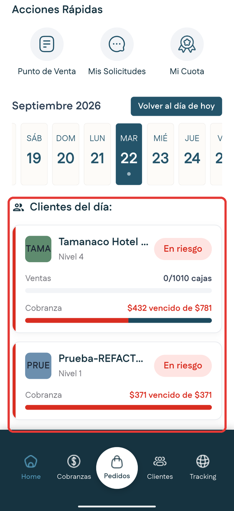
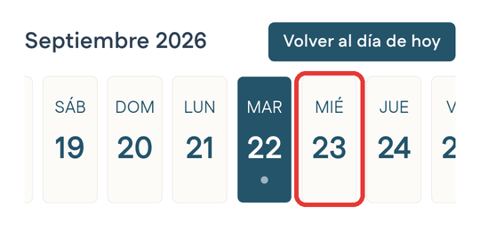
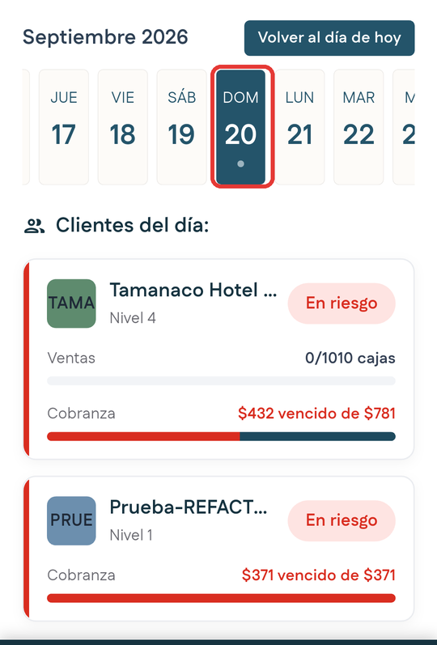
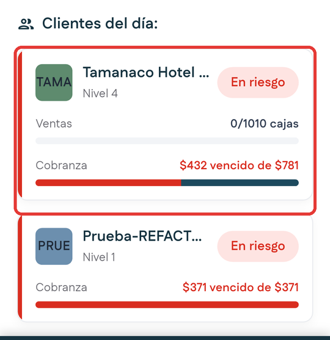
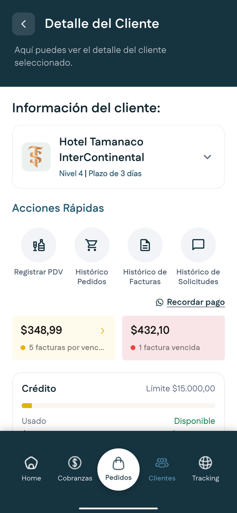

# Inicio

**Para qué sirve:** el Inicio no es un menú de opciones, es tu **tablero del día**. Apenas abres la aplicación, te dice tres cosas sin tocar nada:

- Cómo va tu mes.
- Cuánto tienes por cobrar.
- A quién te toca visitar hoy.

Es la primera pantalla que ves al abrir la aplicación. En la barra inferior aparece con el nombre **Home**.

## Las partes de la pantalla

La pantalla de inicio es más larga que la pantalla del teléfono. Para ver todo, **desliza el dedo hacia arriba**.

### Parte de arriba

Es lo que ves apenas abres la aplicación.

{ .captura }

| # | Qué es | Para qué sirve |
|:-:|---|---|
| 1 | **Encabezado** | Muestra el logo, un saludo, tu nombre y tu rol. El botón de **tres líneas** abre el [menú lateral](../primeros-pasos/navegacion.md#el-menu-lateral). |
| 2 | **Promoción** | La imagen de la campaña vigente. Al tocarla ves su detalle. |
| 3 | **Cajas Vendidas** | Las cajas que llevas vendidas en el mes, su valor en dinero y el porcentaje de cambio frente al mes anterior. Si no hay ventas del mes anterior para comparar, aparece **Sin datos del mes anterior**. El botón **Ver más** abre [Mi Cuota](mi-cuota.md). |
| 4 | **Cobros pendientes** | El monto total por cobrar y cuántos pagos están pendientes. Los montos llevan el símbolo delante, por ejemplo **$432**. El botón **Revisar** te lleva a [Cobranzas](cobranzas.md), donde ves el mismo monto. |

### Parte de abajo

Aparece al deslizar el dedo hacia arriba.

{ .captura }

| # | Qué es | Para qué sirve |
|:-:|---|---|
| 5 | **Acciones Rápidas** | Tres accesos directos: **Punto de Venta**, **Mis Solicitudes** y **Mi Cuota**. |
| 6 | **Tira de días** | Fechas que se deslizan de lado. El día que elijas cambia la lista de clientes de abajo. El botón **Volver al día de hoy** te regresa a la fecha actual. |
| 7 | **Clientes del día** | Los clientes que te toca visitar el día seleccionado, según tu ruta. Cada día tiene sus propios clientes, así que la lista cambia al elegir otra fecha. |

<!-- PENDIENTE: texto exacto del mensaje que aparece cuando el día elegido no tiene visitas, y si el domingo tiene visitas. -->
| 8 | **Barra inferior** | Siempre está visible. Te lleva a **Home**, **Cobranzas**, **Pedidos**, **Clientes** y **Tracking**. La pestaña de la pantalla en la que estás se ve resaltada. |

## Ver el detalle de una promoción

Cada promoción aparece en el Inicio desde su fecha inicial hasta su fecha final, incluida. Por ejemplo, una promoción que termina el día 12 se ve hasta ese día y el 13 ya no aparece.

Toca la imagen de la promoción en el Inicio. Se abre su detalle:

{ .captura }

| # | Qué es |
|:-:|---|
| 1 | Nombre de la promoción, su **vigencia** y cuántos días quedan. |
| 2 | **Descripción** de la promoción. |
| 3 | **Mecánica**: cómo funciona, paso a paso. |
| 4 | **Compartir**: abre la lista de aplicaciones para enviar la promoción al cliente. |

Para regresar al Inicio, toca la **flecha** de arriba a la izquierda.

!!! tip "Consejo"
    Las promociones pueden cambiar según la ruta. La que tú ves puede ser distinta a la de otro compañero.

## Cómo leer una tarjeta de cliente

Cada tarjeta de la lista **Clientes del día** te adelanta cómo está el cliente antes de abrirlo:

{ .captura }

| # | Qué es | Qué te dice |
|:-:|---|---|
| 1 | **Código, nombre y nivel** | Quién es el cliente y su [nivel](../primeros-pasos/antes-de-empezar.md#niveles-de-cliente). |
| 2 | **Distintivo** | Su situación. Ver la tabla de abajo. |
| 3 | **Ventas** | Cuántas cajas lleva comprando de su meta, por ejemplo *0/1010 cajas*. |
| 4 | **Cobranza** | Cuánto tiene vencido de su deuda total. En la barra, la parte **roja** es lo vencido. |

| Distintivo | Qué significa |
|---|---|
| **Al día** | El cliente está al corriente con sus pagos. |
| **Seguir** | Hay que darle seguimiento, pero no es grave. |
| **En riesgo** | Tiene mucha deuda vencida o no está cumpliendo su meta. |

## Ver los clientes que te toca visitar

1. Abre la aplicación. El Inicio aparece solo.

2. Desliza el dedo hacia arriba hasta ver la sección **Clientes del día**.

    { .captura }

3. En la tira de días, toca la fecha que quieres ver. Siempre viene marcado **el día de hoy**.

    { .captura }

4. La fecha que tocaste queda marcada, y la lista de abajo muestra los clientes de ese día según tu ruta.

    { .captura }

    !!! tip "Consejo"
        Para regresar rápido a la fecha de hoy, toca **Volver al día de hoy**.

5. Toca la tarjeta del cliente que quieres ver.

    { .captura }

**Resultado esperado:** se abre la pantalla **Detalle del Cliente**, con todos sus datos. Aprende a leerla en [Ficha del cliente](ficha-cliente.md).

{ .captura }

Para regresar al Inicio, toca la **flecha** de arriba a la izquierda.

## Actualizar los datos

Desde la parte de arriba del Inicio, desliza el dedo hacia abajo y suelta. Aparece un indicador de carga y, en unos segundos, los datos quedan actualizados.

## Salir y volver a la aplicación

Si pulsas el botón **Atrás** del teléfono estando en el Inicio, sales de la aplicación sin cerrar tu sesión. Al volver a abrirla, entras directo al Inicio con tus datos, sin iniciar sesión otra vez.

Para cerrar tu sesión, usa **Cerrar sesión** en el [menú lateral](../primeros-pasos/navegacion.md#el-menu-lateral).

<!-- PENDIENTE: cómo se ve el Inicio sin conexión y cómo se actualiza al volver la señal. -->

## A dónde puedes ir desde aquí

| Si tocas | Vas a |
|---|---|
| Una tarjeta de **Clientes del día** | [Ficha del cliente](ficha-cliente.md) |
| **Ver más**, en Cajas Vendidas | [Mi Cuota](mi-cuota.md) |
| **Revisar**, en Cobros pendientes | [Cobranzas](cobranzas.md) |
| **Punto de Venta**, en Acciones Rápidas | [Punto de Venta](punto-de-venta.md) |
| **Mis Solicitudes**, en Acciones Rápidas | [Mis Solicitudes](mis-solicitudes.md) |
| **Mi Cuota**, en Acciones Rápidas | [Mi Cuota](mi-cuota.md) |
| **Tracking**, en la barra inferior | [Tracking](tracking.md), con los filtros **Todos**, **En ruta** y **Por despachar** |
