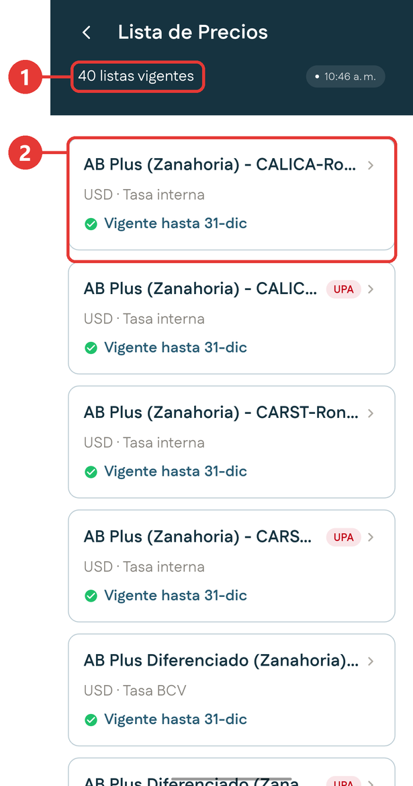
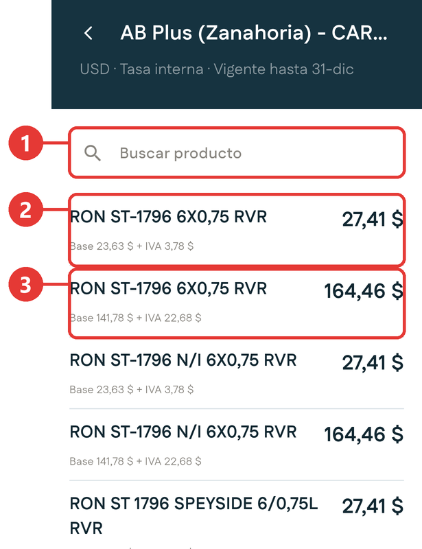
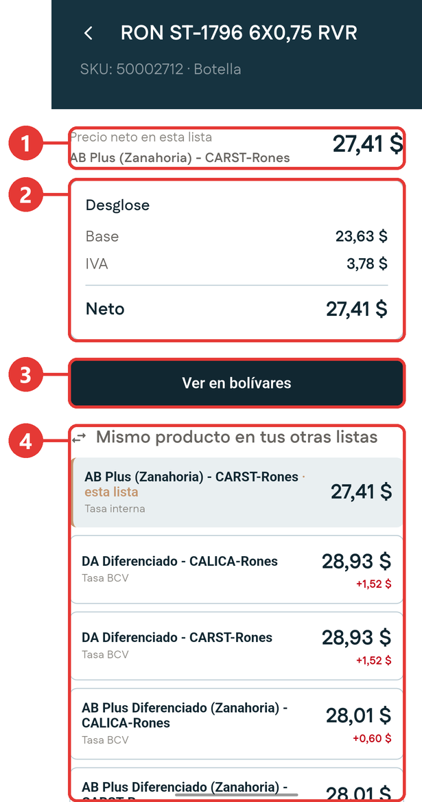

# Lista de precios

**Para qué sirve:** consultas todas las listas de precio vigentes a las que tienes acceso. Te sirve para saber a qué precio queda un producto según la lista, antes de negociar con el cliente.

Para entrar, abre el [menú lateral](../primeros-pasos/navegacion.md#el-menu-lateral) y toca **Lista de precios**.

## El listado de listas

{ .captura }

| # | Qué es |
|:-:|---|
| 1 | Cuántas listas están vigentes. |
| 2 | Cada lista, con su nombre, su moneda, su tipo de tasa y su vigencia. |

Cada lista muestra:

| Dato | Qué significa |
|---|---|
| **Nombre** | Combina el segmento, la sociedad comercial y la familia de producto. Por ejemplo, una lista del segmento Zanahoria para la familia de rones. |
| **Moneda y tipo de tasa** | Todas están en dólares, pero se convierten a bolívares con una tasa distinta: **Tasa interna** o **Tasa BCV**. Esto cambia el monto final en bolívares. |
| **Vigencia** | Hasta cuándo aplica la lista. La marca verde indica que está vigente. |
| **UPA** | Etiqueta roja que aparece en las listas de esa familia de producto. |

## Comparar el precio de un producto entre listas

1. Abre el menú lateral y toca **Lista de precios**.

2. Elige una lista. Fíjate si dice **Tasa interna** o **Tasa BCV**, porque eso cambia el monto en bolívares.

3. Busca el producto con **Buscar producto**.

    { .captura }

    | # | Qué es |
    |:-:|---|
    | 1 | Buscador de productos. |
    | 2 | El producto en presentación **botella**: es la fila de precio menor. |
    | 3 | El mismo producto en presentación **caja**: es la fila de precio mayor. |

    Debajo de cada precio verás el desglose: base más IVA.

4. Toca la presentación que te interesa.

    { .captura }

    | # | Qué es |
    |:-:|---|
    | 1 | **Precio neto** del producto en esta lista. |
    | 2 | **Desglose**: base, IVA y neto. |
    | 3 | **Ver en bolívares**: muestra los montos en bolívares. El botón cambia a **Ver en dólares** para regresar. |
    | 4 | **Mismo producto en tus otras listas**: el precio del producto en cada una de las demás listas. |

5. Revisa **Mismo producto en tus otras listas**. La lista en la que estás aparece resaltada y marcada como **esta lista**. La cifra en rojo debajo de cada precio es cuánto más caro queda en esa otra lista.

!!! tip "Para qué sirve comparar"
    Te responde en el momento una pregunta frecuente en la calle: si a este cliente le aplico otra lista, ¿cuánto cambia el precio?
