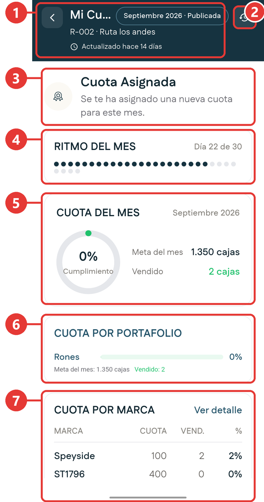
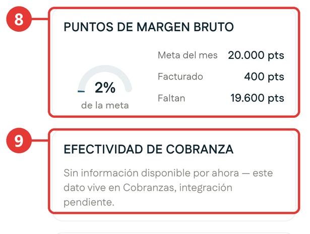
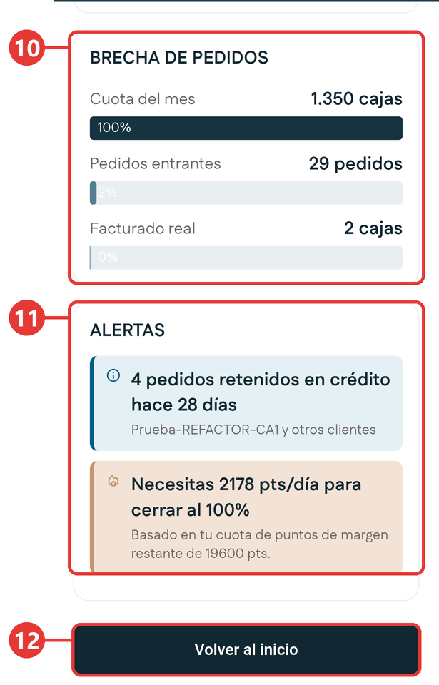
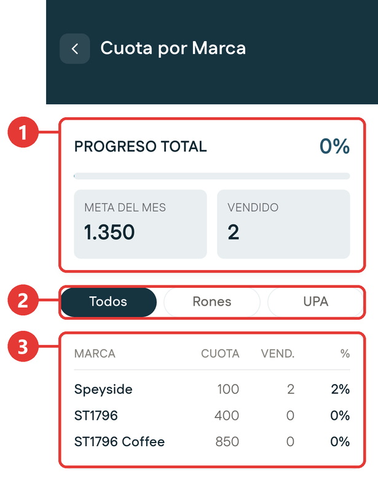
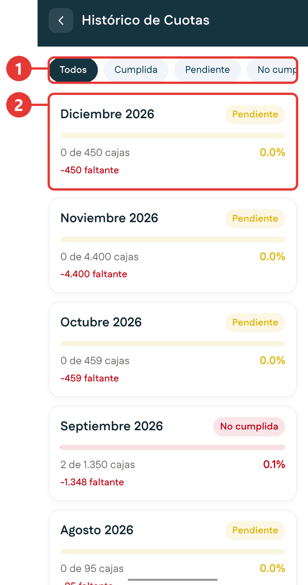

# Mi Cuota

**Para qué sirve:** es tu indicador personal. Te dice cuánto tienes que vender en el mes, cómo vas y qué conviene vender para cumplir.

La cuota la asigna la gerencia desde el portal web. No se puede cambiar desde la aplicación; si no es alcanzable, puedes pedir una revisión desde [Mis Solicitudes](mis-solicitudes.md#crear-una-solicitud-de-compensacion).

## Cómo entrar

- En el Inicio, toca **Mi Cuota** en Acciones Rápidas.
- En el Inicio, toca **Ver más** en la tarjeta **Cajas Vendidas**.

Las dos vías abren la misma pantalla. Arriba tiene el botón para volver, el título **Mi Cuota** y, a la derecha, el botón de historial.

Si todavía no hay información de cuota, en el centro aparece **No hay información de cuota disponible por ahora.** con el botón **Reintentar**, que vuelve a consultarla.

## Las partes de la pantalla

<!-- PENDIENTE: confirmar con conexión los nombres y el contenido de cada parte de la pantalla, del encabezado a las Alertas. -->

La pantalla es larga. Desliza el dedo hacia arriba para recorrerla.

### Cuota del mes

{ .captura }

| # | Qué es | Qué te dice |
|:-:|---|---|
| 1 | **Encabezado** | El período de la cuota y si está publicada, tu ruta y hace cuánto se actualizó la información. |
| 2 | **Histórico de Cuotas** | Abre tus cuotas de otros meses. |
| 3 | **Cuota Asignada** | Aviso que aparece cuando la gerencia publica una cuota nueva para el mes. |
| 4 | **Ritmo del mes** | En qué día del mes vas. Hay un punto por cada día. |
| 5 | **Cuota del mes** | La meta del mes en cajas, las cajas vendidas y el porcentaje de cumplimiento. |
| 6 | **Cuota por portafolio** | Tu avance por familia de producto, por ejemplo Rones. |
| 7 | **Cuota por marca** | Tu cuota, lo vendido y el porcentaje de cada marca. **Ver detalle** abre la tabla completa. |

### Puntos y cobranza

{ .captura }

| # | Qué es | Qué te dice |
|:-:|---|---|
| 8 | **Puntos de margen bruto** | La meta del mes en puntos, lo facturado y cuánto falta, con el porcentaje de avance. |
| 9 | **Efectividad de cobranza** | Qué tan efectivos son tus cobros. Si todavía no hay información, la tarjeta lo indica. |

!!! tip "Cajas y puntos no son lo mismo"
    La cuota se mide en **cajas**, pero el margen se mide en **puntos**. Cada producto aporta una cantidad distinta de puntos por caja, y algunos no aportan puntos. Por eso puedes ir bien en cajas y atrasado en puntos: no es lo mismo vender cajas de un producto que de otro.

### Pedidos y alertas

{ .captura }

| # | Qué es | Qué te dice |
|:-:|---|---|
| 10 | **Brecha de pedidos** | Compara tu cuota del mes con los pedidos que entraron y con lo facturado real. |
| 11 | **Alertas** | Avisos importantes, por ejemplo pedidos retenidos en crédito o cuántos puntos por día necesitas para cerrar al 100%. |
| 12 | **Volver al inicio** | Regresa al Inicio. |

## Revisar tu avance del mes

1. Entra a **Mi Cuota**.
2. Confirma en el encabezado que el período es el correcto y que la cuota aparece como **Publicada**.
3. En **Cuota del mes**, mira cuántas cajas llevas de la meta.
4. En **Ritmo del mes**, mira en qué día del mes vas.
5. En **Cuota por marca**, identifica las marcas que van más atrasadas.
6. En **Puntos de margen bruto**, revisa cuántos puntos te faltan.
7. Lee las **Alertas**: te dicen qué atender primero.

## Ver la cuota por marca

1. En **Cuota por marca**, toca **Ver detalle**.

    { .captura }

    | # | Qué es |
    |:-:|---|
    | 1 | **Progreso total**: la meta del mes y lo vendido. |
    | 2 | Filtros por familia: **Todos**, **Rones** y **UPA**. |
    | 3 | La tabla por marca: cuota, vendido y porcentaje. |

## Ver tus cuotas de otros meses

1. Toca el botón de **historial**, arriba a la derecha. Se abre **Histórico de Cuotas**. Si no se puede cargar, aparece **No se pudo cargar el histórico de cuotas.** con el botón **Reintentar**.

    <!-- PENDIENTE: confirmar con conexión los filtros y el contenido de cada mes del Histórico de Cuotas. -->

    { .captura }

    | # | Qué es |
    |:-:|---|
    | 1 | Filtros: **Todos**, **Cumplida**, **Pendiente** y **No cumplida**. |
    | 2 | Cada mes, con su estado, las cajas vendidas de la meta, el porcentaje y cuánto faltó. |

## Si no tienes conexión

<!-- PENDIENTE: qué muestran Mi Cuota, la tarjeta Cajas Vendidas y el Histórico de Cuotas sin señal cuando ya se consultaron antes con conexión. -->
