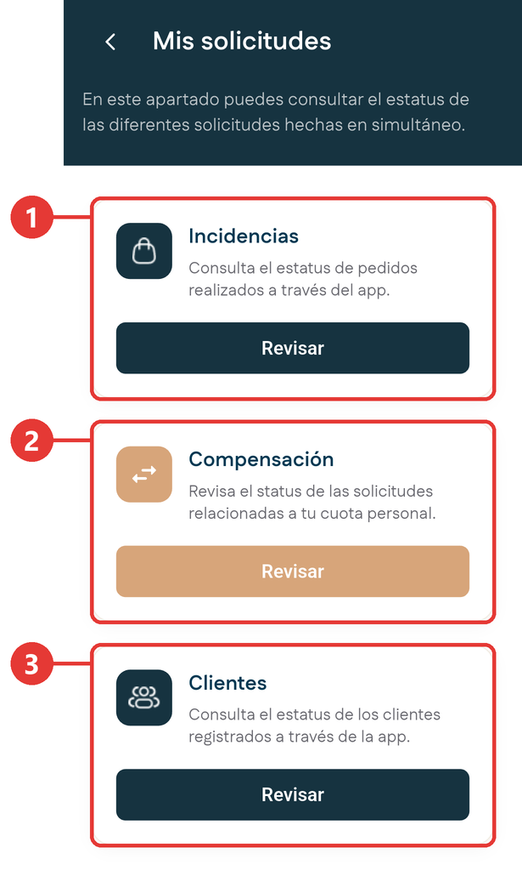
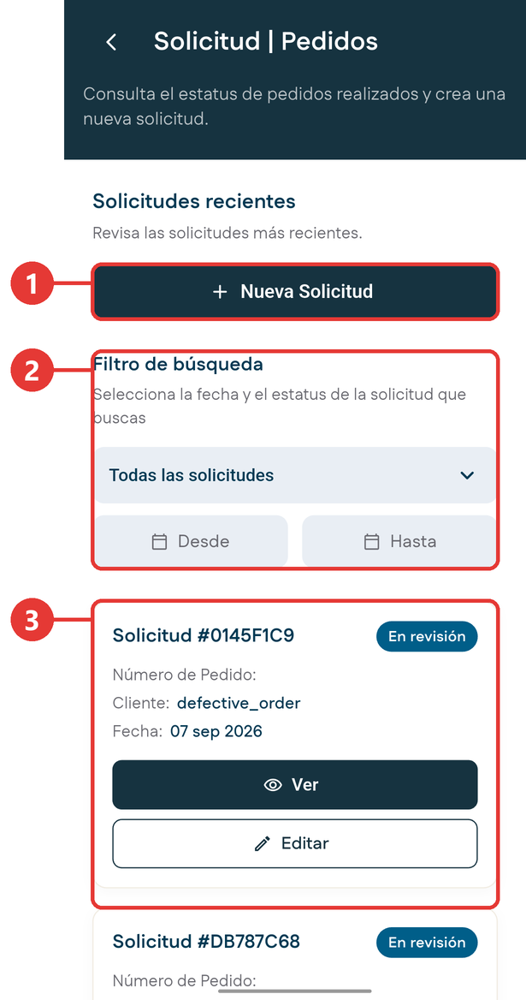
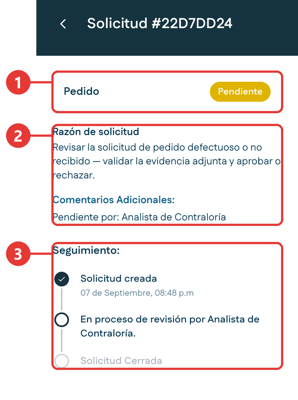
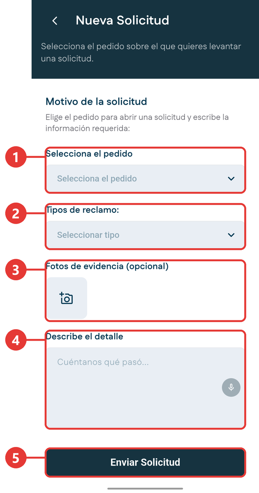
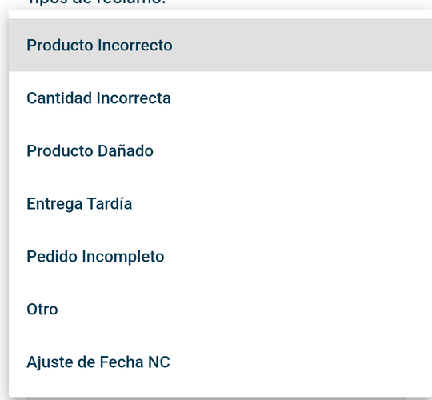
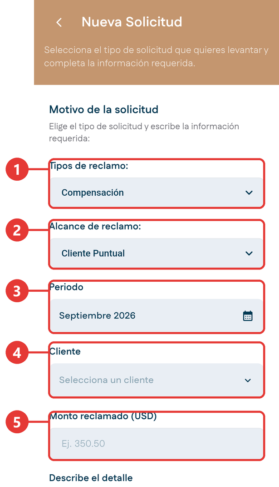
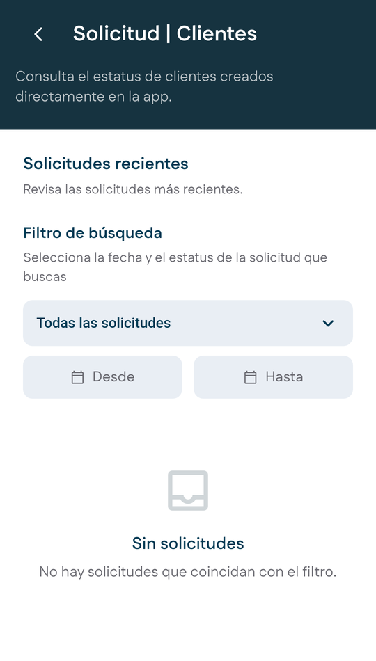

# Mis Solicitudes

**Para qué sirve:** es la bandeja de todo lo que enviaste a aprobación. Sirve para consultar el estado de lo que está en curso y para crear solicitudes nuevas, como el reporte de una incidencia.

## Cómo entrar

- En el Inicio, toca **Mis Solicitudes** en Acciones Rápidas.
- En la [ficha del cliente](ficha-cliente.md), toca **Histórico de Solicitudes**.

## Las categorías

{ .captura }

| # | Categoría | Qué contiene |
|:-:|---|---|
| 1 | **Incidencias** | Los reclamos sobre pedidos ya realizados. Desde aquí se crean nuevos reclamos. |
| 2 | **Compensación** | Las solicitudes relacionadas con tu cuota personal, incluida la revisión de cuota. |
| 3 | **Clientes** | El estado de las altas de cliente que enviaste desde [Clientes](clientes.md). |

Toca **Revisar** en la categoría que quieres consultar.

## La lista de solicitudes

{ .captura }

| # | Qué es |
|:-:|---|
| 1 | **Nueva Solicitud**: crea una solicitud nueva. |
| 2 | **Filtro de búsqueda**: por estado y por rango de fechas. |
| 3 | Cada solicitud, con su número, su estado y los botones **Ver** y **Editar**. |

## Estados de una solicitud

| Estado | Qué significa | Qué puedes hacer |
|---|---|---|
| **Pendiente** | Recién creada, esperando la primera revisión. | Ver. |
| **En revisión** | Está pasando por las revisiones de aprobación. | Ver y editar. |
| **Aprobada** | Se aprobó. | Ver. |
| **Rechazada** | No procede con los datos enviados. | Ver. |

!!! warning "Solo se edita mientras está en revisión"
    Una solicitud solo se puede modificar mientras está **En revisión**. Si rechazan un pedido, no se corrige: se crea uno nuevo.

## Consultar el estado de una solicitud

1. Entra a **Mis Solicitudes**.
2. Toca **Revisar** en la categoría que corresponda.
3. Usa el **Filtro de búsqueda** para acotar por estado y por fechas.
4. Ubica la solicitud y revisa su estado.
5. Toca **Ver** para abrir el detalle.

    { .captura }

    | # | Qué es |
    |:-:|---|
    | 1 | El tipo de solicitud y su estado. |
    | 2 | La razón de la solicitud y los comentarios, incluida el área que la tiene pendiente. |
    | 3 | **Seguimiento**: en qué hito va la solicitud. |

6. Si está en revisión y necesitas corregir algo, vuelve a la lista y toca **Editar**.

## Reportar una incidencia sobre un pedido

Úsalo cuando un pedido llegó con problemas. Por ejemplo: el comercio recibe su despacho y encuentra botellas rotas. Visitas el establecimiento, verificas el daño y levantas la solicitud sobre ese pedido.

1. Entra a **Mis Solicitudes** y toca **Revisar** en **Incidencias**.

2. Toca **Nueva Solicitud**.

    { .captura }

    | # | Qué se llena |
    |:-:|---|
    | 1 | **Selecciona el pedido**: aparecen tus pedidos por código, del más reciente al más antiguo. |
    | 2 | **Tipos de reclamo**: elige de qué se trata. |
    | 3 | **Fotos de evidencia**: opcional, pero conviene adjuntarlas para que la revisión avance más rápido. |
    | 4 | **Describe el detalle**: cuenta qué pasó. También puedes dictarlo con el micrófono. |
    | 5 | **Enviar Solicitud**. |

3. Elige el pedido que tuvo el problema.

4. Elige el tipo de reclamo:

    { .captura }

    | Tipo | Cuándo se usa |
    |---|---|
    | **Producto Incorrecto** | Llegó un producto distinto al pedido. |
    | **Cantidad Incorrecta** | Llegó más o menos de lo pedido. |
    | **Producto Dañado** | Mercancía rota o en mal estado. |
    | **Entrega Tardía** | El despacho llegó fuera de fecha. |
    | **Pedido Incompleto** | Faltaron productos del pedido. |
    | **Ajuste de Fecha NC** | Corrección de la fecha de una nota de crédito. |
    | **Otro** | Cualquier caso que no encaje en los anteriores. |

5. Si tienes evidencia, agrégala en **Fotos de evidencia**.

6. Escribe en **Describe el detalle** qué pasó.

7. Toca **Enviar Solicitud** y confirma el envío.

**Resultado esperado:** se abre el detalle de la solicitud recién creada, con su número y su seguimiento en el primer hito.

!!! tip "Qué pasa después"
    Cuando la solicitud se aprueba, viene la solución: reponer la mercancía, incluirla en el próximo despacho, emitir una nota de crédito o, en último caso, devolver el dinero. La empresa prefiere reponer, porque el objetivo es que el cliente vuelva a tener el producto.

## Crear una solicitud de compensación

1. Entra a **Mis Solicitudes** y toca **Revisar** en **Compensación**.

2. Toca **Nueva Solicitud**.

    { .captura }

    | # | Qué se llena |
    |:-:|---|
    | 1 | **Tipos de reclamo**: **Compensación**, **Pedido defectuoso / no recibido**, **Cambio de fecha de recepción de factura** o **Revisión de cuota**. |
    | 2 | **Alcance de reclamo**: **Cliente Puntual** o **Periodo Completo**. |
    | 3 | **Periodo**: el mes al que corresponde. |
    | 4 | **Cliente**: el cliente afectado, cuando el alcance es un cliente puntual. |
    | 5 | **Monto reclamado** en dólares. |

3. Completa los datos y escribe en **Describe el detalle** el motivo.

4. Envía la solicitud.

!!! tip "Si tu cuota no es alcanzable"
    Para pedir un ajuste de tu cuota del mes, crea una solicitud de compensación con el tipo **Revisión de cuota** y explica el motivo.

## Consultar las altas de cliente

Entra a **Mis Solicitudes** y toca **Revisar** en **Clientes**. Ahí ves el estado de cada cliente que registraste. Si todavía no has registrado ninguno, la lista aparece vacía.

{ .captura }
