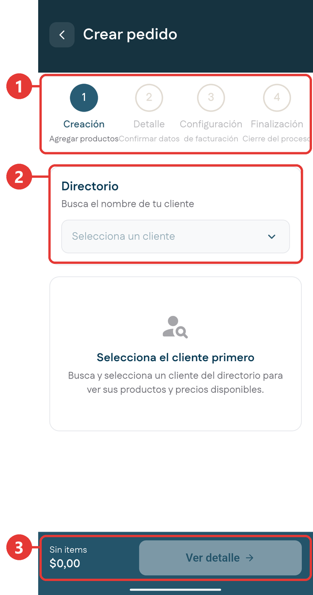
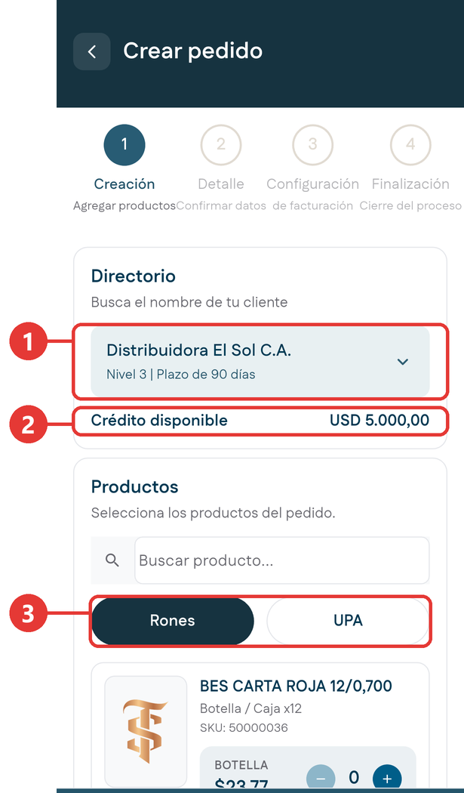
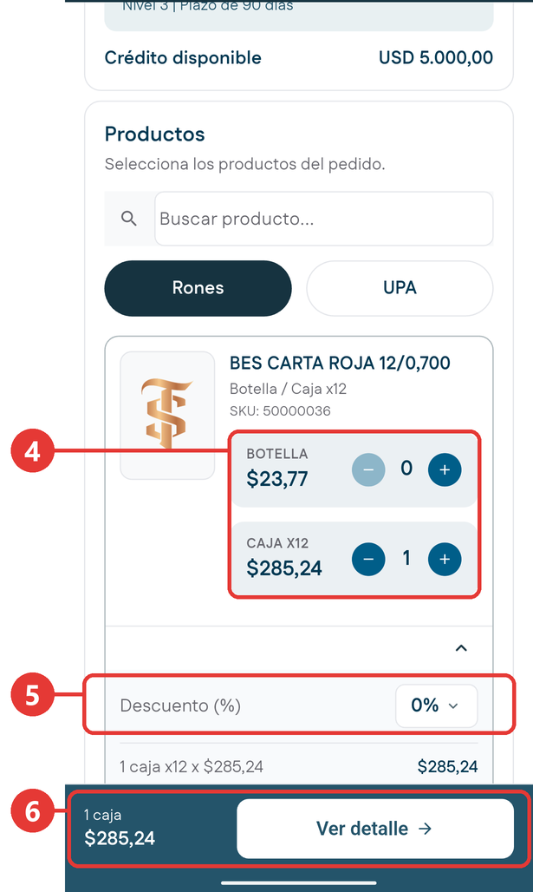
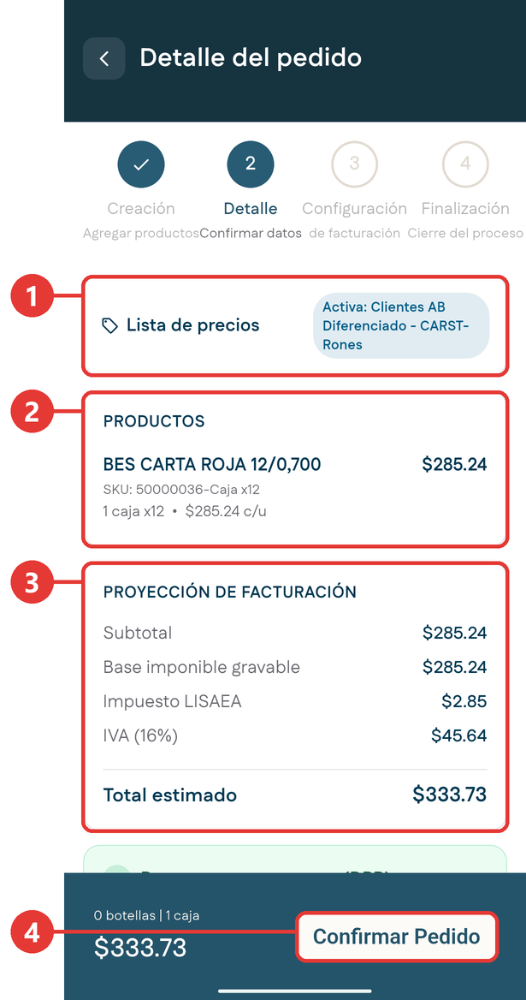
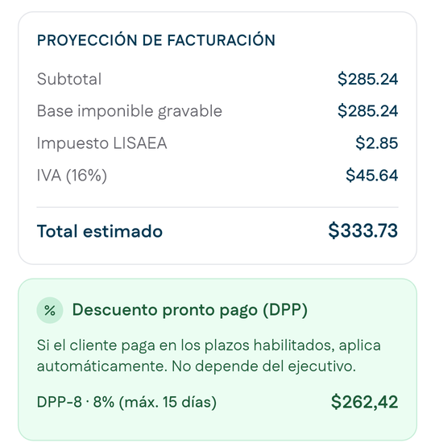

# Pedidos

**Para qué sirve:** aquí levantas la orden de compra de un cliente. Es un asistente de cuatro pasos que calcula los precios según el segmento del cliente y los impuestos que aplican.

!!! warning "Un pedido no sale despachado de inmediato"
    Al confirmarlo, el pedido se convierte en una **solicitud** que entra en revisión. Solo después se aprueba. Lee más en [Antes de empezar](../primeros-pasos/antes-de-empezar.md#tu-solicitas-otras-areas-aprueban).

## Los cuatro pasos

| Paso | Nombre | Qué se define |
|:-:|---|---|
| 1 | **Creación** | El cliente y los productos con sus cantidades. |
| 2 | **Detalle** | La lista de precios y la proyección de facturación con impuestos. |
| 3 | **Configuración** | Los requerimientos de facturación del cliente y las notas para distribución. |
| 4 | **Finalización** | La confirmación. El pedido pasa a revisión. |

## Cómo se venden los productos

Cada producto se puede pedir en dos presentaciones, cada una con su precio y su contador: **por botella** o **por caja**.

El precio de la botella es el precio de la caja dividido entre las botellas que trae. Por ejemplo, una caja de 12 botellas a $285,24 deja la botella en $23,77.

## Impuestos y descuentos

| Concepto | Qué es |
|---|---|
| **Base imponible gravable** | El monto sobre el que se calculan los impuestos, después de aplicar los descuentos. |
| **Impuesto LISAEA** | Impuesto sobre alcohol y especies alcohólicas. Varía según el grado alcohólico y la categoría del producto. |
| **IVA** | 16% sobre la base imponible. |
| **DPP** | Descuento por pronto pago. Se aplica solo si el cliente paga dentro de los plazos habilitados. No depende del ejecutivo y no se puede forzar. Si el cliente tiene facturas vencidas, no aplica. |

## Crear un pedido

### Paso 1: Creación

1. Entra por una de estas dos vías:
    - En la barra inferior, toca **Pedidos**.
    - En la [ficha del cliente](ficha-cliente.md), desliza hasta el final, debajo de **Meta de Ventas** y **Meta de Cobranza**, y toca **Crear Pedido**. Así el cliente ya viene seleccionado y pasas directo a agregar productos.

    Se abre **Crear pedido**. Mientras no eliges un cliente, se ve el aviso **Selecciona el cliente primero** y la barra inferior muestra **Sin items**, **$0,00** y el botón **Ver detalle** desactivado.

    { .captura }

    | # | Qué es |
    |:-:|---|
    | 1 | Los cuatro pasos del asistente. El paso actual aparece resaltado. |
    | 2 | **Directorio**: aquí eliges el cliente. |
    | 3 | Resumen del pedido y botón **Ver detalle**. Se activa cuando agregas productos. |

2. En **Directorio**, toca **Selecciona un cliente**. Se abre la ventana **Seleccionar cliente**: escribe el nombre en el buscador y elige el cliente de la lista.

3. Espera a que carguen los productos. Aparecen los datos del cliente:

    { .captura }

    | # | Qué es |
    |:-:|---|
    | 1 | El cliente, su nivel y su plazo de pago, por ejemplo **Nivel 2 \| Plazo de 30 días**. |
    | 2 | **Crédito disponible** del cliente. |
    | 3 | Filtros por categoría: **Rones** y **UPA**. También puedes usar el buscador **Buscar producto...**: la lista se filtra mientras escribes parte del nombre. |

4. Busca el producto. Cada uno muestra su nombre, su presentación, por ejemplo Botella / Caja x12, y su **SKU**. Debajo tiene dos filas, **BOTELLA** y **CAJA X12**, cada una con su precio y su contador. Toca **más** para sumar una unidad y **menos** para restarla. El botón **menos** aparece cuando el contador pasa de cero. Puedes cargar botellas y cajas del mismo producto por separado.

    { .captura }

    | # | Qué es |
    |:-:|---|
    | 4 | Las dos presentaciones del producto, **Botella** y **Caja**, cada una con su precio y su contador. |
    | 5 | **Descuento**: aparece al agregar el producto y empieza en **0%**. Al tocarlo se abre **Seleccionar descuento**, con **Sin descuento** y las campañas vigentes. Elige la que corresponda. |
    | 6 | Resumen del pedido: cantidades, por ejemplo **2 botellas \| 1 caja**, y monto, por ejemplo **$362,28**. Toca **Ver detalle** para seguir. |

5. Revisa el resumen de la barra inferior y toca **Ver detalle**.

### Paso 2: Detalle

6. Se abre **Detalle del pedido**. Revísalo:

    { .captura }

    | # | Qué es |
    |:-:|---|
    | 1 | **Lista de precios** activa para este pedido, por ejemplo **Activa: L.Diferenciada - CARST-Rones**. |
    | 2 | **Productos** del pedido, con su SKU, la cantidad, el precio por unidad y, si tiene descuento, el descuento en dólares y en porcentaje, por ejemplo **-$9.00 · -3%**. |
    | 3 | **Proyección de facturación**: **Subtotal**, **Base imponible gravable**, **Impuesto LISAEA**, **IVA (16%)** y **Total estimado**. |
    | 4 | **Confirmar Pedido**: pasa al paso 3. |

    Si el cliente te entregó una orden de compra, adjúntala en **Agregar orden de compra**: toma una foto o elige una imagen de la galería o de tus archivos. Es opcional.

7. Desliza hacia abajo y revisa el recuadro del **Descuento pronto pago (DPP)**. Te indica si el descuento aplica, de cuánto es y el plazo máximo para aprovecharlo. Si el cliente no lo tiene, dice **Este cliente no tiene descuento por pronto pago configurado.**

    { .captura }

8. Toca **Confirmar Pedido**.

### Paso 3: Configuración

9. Se abre **Configuración de factura**. El aviso **Separación Ron / UPA aplicada automáticamente por el sistema** indica que las facturas se separan solas por familia de producto. No tienes que hacer nada.
10. Si el cliente lo pide, activa **Requerimientos del cliente** y marca la facturación por producto individual.

    <!-- PENDIENTE: opciones que aparecen al activar Requerimientos del cliente. -->

11. Escribe las **Notas para distribución** si hay alguna instrucción de despacho. También puedes dictarlas con el micrófono que está al lado del campo.
12. Toca **Confirmar Pedido** para enviar.

### Paso 4: Finalización

13. Se abre **Resumen del pedido**, con el cliente y el código del pedido. El pedido queda creado y en revisión. Toca **Ver detalle de pedido** para ver su seguimiento, o **Volver al inicio**.

    <!-- PENDIENTE: Resumen del pedido con conexión, código definitivo y pantalla de Ver detalle de pedido. -->

!!! warning "Al terminar, sal con Volver al inicio"
    Después de confirmar el pedido, usa el botón **Volver al inicio**. No uses el botón para ir atrás del teléfono.

## Los estados de un pedido

Puedes seguir tus pedidos en el [Histórico de Pedidos](historicos.md#historico-de-pedidos). Para abrirlo, toca **Histórico Pedidos** en la ficha del cliente. Ahí puedes buscar con **Buscar código de pedido** y filtrar por **Todo**, **Pendiente**, **Confirmado** y **Rechazado**.

<!-- PENDIENTE: confirmar con conexión la lista de estados de un pedido y su relación con los filtros Confirmado y Rechazado. -->

Estos son los estados que puede tener un pedido:

| Estado | Qué significa |
|---|---|
| **Pendiente** | Recién creado, esperando revisión. |
| **En revisión** | Está pasando por las revisiones de aprobación. |
| **Picking** | Aprobado; se está preparando la mercancía en el almacén. |
| **En camino** | Salió a despacho. |
| **Entregado** | El cliente ya recibió la mercancía. |

Una vez aprobado y facturado, la factura entra en tu cartera de [Cobranzas](cobranzas.md).

## Si no tienes conexión

Puedes crear un pedido aunque no tengas señal.

- Entra desde la ficha del cliente con **Crear Pedido**. El cliente ya viene seleccionado, con sus productos y precios guardados en el teléfono.
- En **Detalle del pedido** aparece el aviso **Cálculo estimado sin conexión. Se validará contra el servidor al sincronizar.** Los montos son una estimación hasta que vuelva la señal.
- Al confirmar, **Resumen del pedido** muestra el código provisional **#PED-NUEVO** y el mensaje **Pedido guardado sin conexión**: el pedido queda guardado en el teléfono y se envía solo cuando vuelve la señal. Toca **Volver al inicio**.

<!-- PENDIENTE: cómo aparece en el Histórico de Pedidos un pedido guardado sin conexión y cómo cambia su código al enviarse. -->
