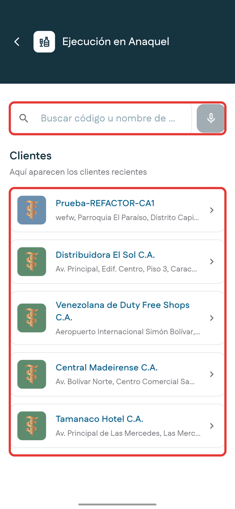
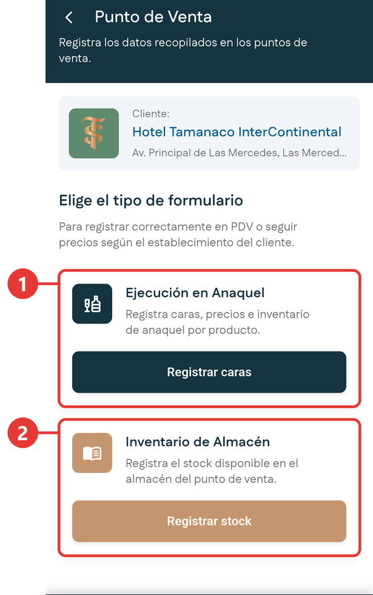
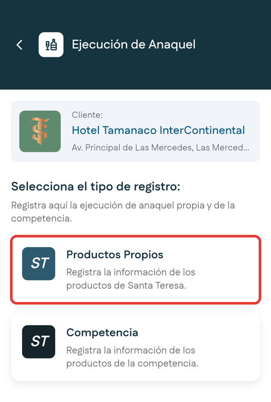
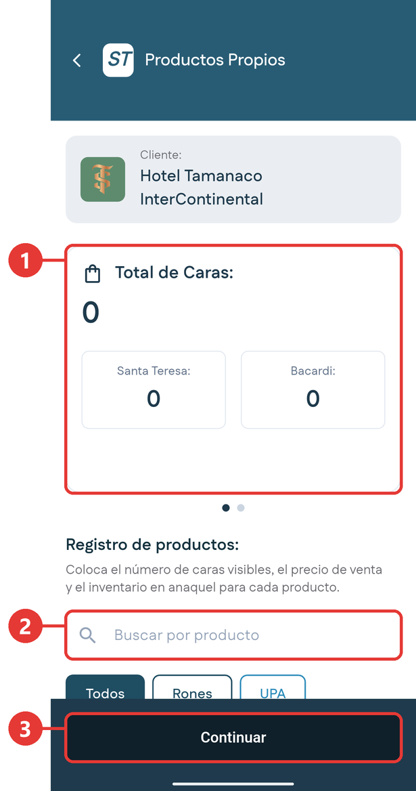
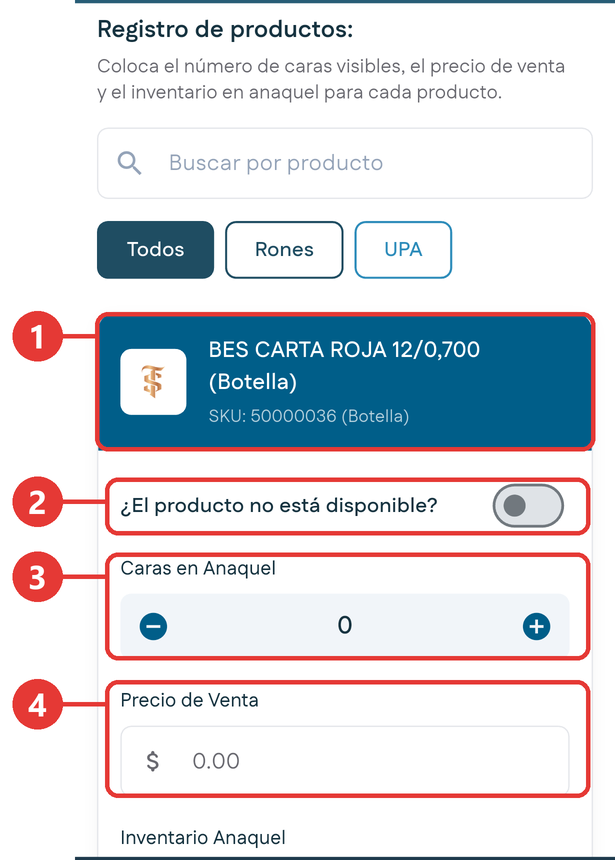
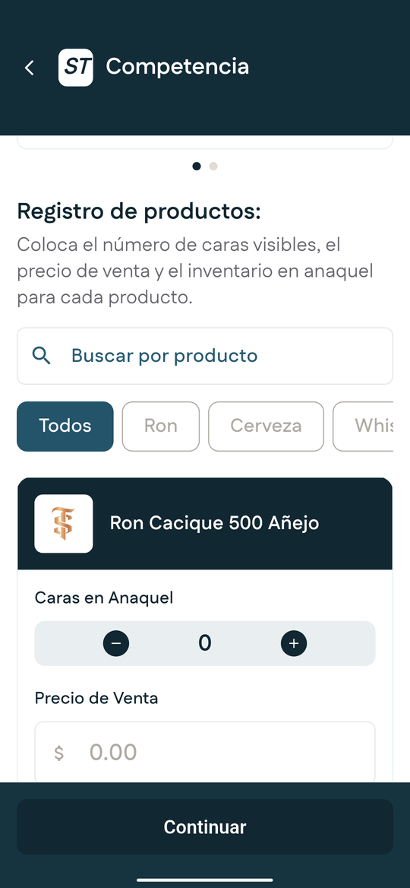
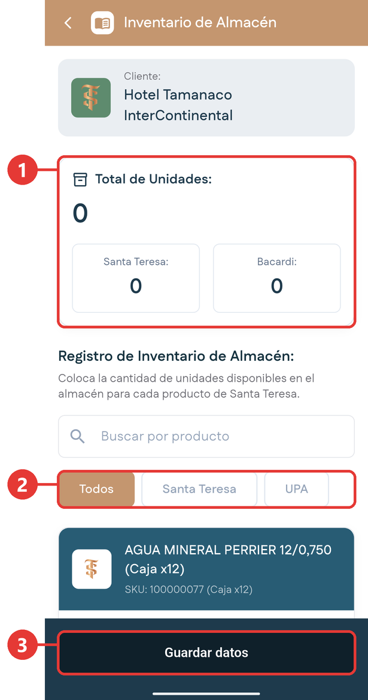

# Punto de Venta

**Para qué sirve:** aquí registras cómo está el producto dentro del comercio del cliente. Llegas al establecimiento, observas el producto y lo anotas: cuánto se ve, a qué precio lo venden, cuánto queda en existencia y qué está haciendo la competencia en el mismo estante.

!!! tip "El nombre puede confundir"
    En esta aplicación, **punto de venta** es el establecimiento del cliente. Este módulo no cobra ni vende nada: es un registro de lo que ves en el comercio.

## Para qué se usa esta información

Lo que registras aquí alimenta los cálculos del sistema central y sirve para tres cosas:

- **Predecir la próxima compra.** Si el anaquel se está vaciando y el almacén tiene poca existencia, el cliente pronto necesitará reponer.
- **Medir la posición frente a la competencia.** Por eso también se registran los productos del competidor y sus precios.
- **Controlar el precio de reventa.** La empresa necesita saber a qué precio el comercio vende el producto al público.

## Palabras que necesitas conocer

| Palabra | Qué significa |
|---|---|
| **Anaquel** | El estante donde el producto está exhibido, a la vista del comprador. |
| **Almacén** | La trastienda del comercio, donde guarda las cajas que todavía no están en el anaquel. |
| **Cara** | Cada unidad de producto visible de frente en el estante. Solo cuenta la primera fila: si hay tres botellas de frente y ocho detrás de cada una, son **tres caras**. |

## En qué unidad se cuenta cada cosa

| Qué registras | En qué unidad |
|---|---|
| Inventario en anaquel | Botellas |
| Inventario de almacén | Cajas |
| Caras | Unidades visibles de frente, sin contar las de atrás |

## Los formularios

Punto de Venta tiene tres formularios:

| Formulario | Qué registras | Filtros | Foto |
|---|---|---|---|
| **Productos Propios** | Caras, precio de venta e inventario en anaquel. | Todos, Rones y UPA. | Sí, obligatoria. |
| **Competencia** | Lo mismo, para los productos de la competencia. | Todos, Ron, Cerveza y Whiskey. | Sí, obligatoria. |
| **Inventario de Almacén** | Unidades disponibles en el almacén. | Todos, Santa Teresa y UPA. | No. |

Los productos propios cubren todo el portafolio de la casa: rones, el portafolio ampliado y las marcas distribuidas, como Bacardi. Registrar la competencia es opcional; lo prioritario son los productos propios.

## Elegir el cliente y el formulario

1. Entra por una de estas dos vías:
    - En el Inicio, toca **Punto de Venta** en Acciones Rápidas.
    - En la [ficha del cliente](ficha-cliente.md), toca **Registrar PDV**, el primer botón de **Acciones Rápidas**. Así el cliente ya viene seleccionado y pasas directo al paso 3.

2. Busca el cliente por código o nombre, o díctalo con el **micrófono**. También puedes tocarlo en la lista **Clientes**, donde aparecen los clientes recientes.

    { .captura }

3. Se abre **Punto de Venta**, con la tarjeta **Cliente:** y el nombre del cliente. En **Elige el tipo de formulario**, elige uno:

    { .captura }

    | # | Formulario | Botón |
    |:-:|---|---|
    | 1 | **Ejecución en Anaquel**: caras, precios e inventario del anaquel. | **Registrar caras** |
    | 2 | **Inventario de Almacén**: unidades en el almacén. | **Registrar stock** |

## Registrar el anaquel con productos propios

1. Elige el cliente y toca **Registrar caras**.

2. Se abre **Ejecución de Anaquel**, que te pide elegir el tipo de registro. Toca **Productos Propios**.

    { .captura }

3. Se abre el formulario:

    { .captura }

    | # | Qué es |
    |:-:|---|
    | 1 | **Total de Caras**: se va sumando mientras registras, con el desglose **Santa Teresa** y **Bacardi**. |
    | 2 | Buscador de productos. Debajo están los filtros **Todos**, **Rones** y **UPA**. |
    | 3 | **Continuar**: pasa a la foto de evidencia. |

4. Busca el producto o filtra por categoría. Cada presentación del producto aparece por separado, por ejemplo botella y caja.

5. Completa los datos de cada producto:

    { .captura }

    | # | Dato | Cómo se llena |
    |:-:|---|---|
    | 1 | Nombre, presentación y código del producto. | No se llena, es informativo. |
    | 2 | **¿El producto no está disponible?** | Actívalo si el comercio no maneja ese producto. |
    | 3 | **Caras en Anaquel** | Con los botones **menos** y **más**. |
    | 4 | **Precio de Venta** | A cuánto lo vende el comercio al público. |

    Debajo está **Inventario Anaquel**: las botellas exhibidas, también con los botones **menos** y **más**.

    !!! warning "Cero no es lo mismo que no disponible"
        Si registras **cero**, significa que revisaste y no había producto. Si activas **¿El producto no está disponible?**, significa que ese comercio no maneja el producto.

6. Toca **Continuar**.

7. Se abre la pantalla de la foto de evidencia. La tarjeta del cliente muestra cuántas fotos llevas. Toca el botón redondo de la cámara para abrirla. La primera vez, el teléfono te pide permiso para usar la cámara; acéptalo. Encuadra los productos dentro del marco y toma la foto. Si sale mal, bórrala con la **X** roja y tómala de nuevo. Puedes tomar varias fotos; necesitas al menos una para guardar.

    <!-- PENDIENTE: cámara abierta, foto tomada y forma de borrarla. -->

    !!! tip "Consejo"
        Encuadra el anaquel completo y con buena luz. Estas fotos sirven como evidencia y, a futuro, un sistema las leerá para reconocer caras y precios de forma automática.

8. Toca **Guardar Información**. Si todavía no tomaste ninguna foto, la aplicación te avisa con **Tome al menos una foto antes de guardar.**

9. Revisa el resumen: los totales de caras e inventario y el detalle de cada producto.

10. Toca **Finalizar**.

    <!-- PENDIENTE: pantalla de resumen y botón Finalizar. -->

**Resultado esperado:** la aplicación vuelve a la pantalla para elegir el tipo de formulario. Cada visita es un registro nuevo: si vuelves a entrar, el formulario aparece en blanco.

## Registrar los productos de la competencia

1. Elige el cliente, toca **Registrar caras** y luego **Competencia**.

2. Filtra por tipo de licor: **Ron**, **Cerveza** o **Whiskey**.

    { .captura }

3. Registra caras, precio de venta e inventario, igual que con los productos propios. Este formulario no tiene la opción de producto no disponible.

4. Toca **Continuar**, toma la foto de evidencia, revisa el resumen y toca **Finalizar**.

## Registrar el inventario del almacén

1. Elige el cliente y toca **Registrar stock**.

    { .captura }

    | # | Qué es |
    |:-:|---|
    | 1 | **Total de Unidades**, con el desglose **Santa Teresa** y **Bacardi**. |
    | 2 | Buscador **Buscar por producto** y filtros **Todos**, **Santa Teresa** y **UPA**. |
    | 3 | **Guardar datos**. |

2. Indica las **Unidades disponibles** de cada producto con los botones **menos** y **más**. Es el único dato que se pide.

3. Toca **Guardar datos**. Si no registraste ninguna unidad, la aplicación te avisa con **Por favor, registre al menos una unidad.**

**Resultado esperado:** los datos se guardan de una vez. Este formulario no pide foto ni muestra resumen.

!!! tip "Sin aprobación"
    A diferencia de los pedidos o las altas de cliente, lo que registras en Punto de Venta no pasa por aprobación. Se guarda directamente.

## Si no tienes conexión

Puedes registrar el punto de venta aunque no tengas señal. Entra desde la ficha del cliente con **Registrar PDV**: el cliente ya viene seleccionado. Lo que guardes se queda en el teléfono y se envía solo cuando vuelve la señal.

<!-- PENDIENTE: cómo se ven sin conexión el buscador de clientes, las listas de productos propios, competencia y almacén, y el registro guardado pendiente de envío. -->
