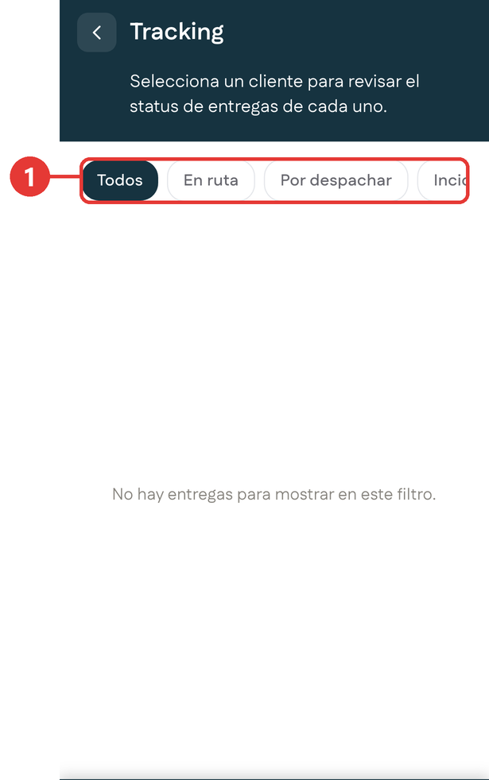

# Tracking

**Para qué sirve:** aquí revisas el estado de las entregas de tus clientes.

Para entrar, toca **Tracking** en la barra inferior.

{ .captura }

| # | Qué es |
|:-:|---|
| 1 | Filtros por estado de la entrega: **Todos**, **En ruta**, **Por despachar** e **Incidencias**. Desliza de lado para ver todos. |

Toca un filtro para ver las entregas en ese estado. Si no hay entregas, la pantalla lo indica con el mensaje **No hay entregas para mostrar en este filtro**.
