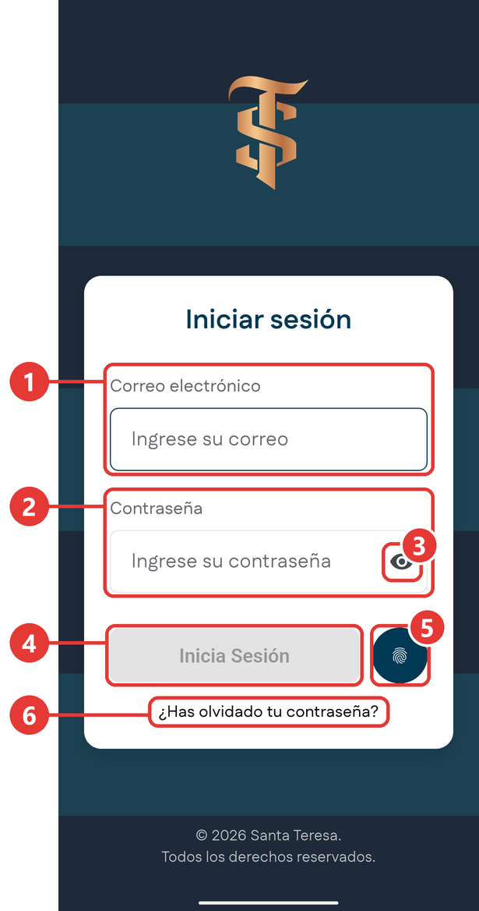
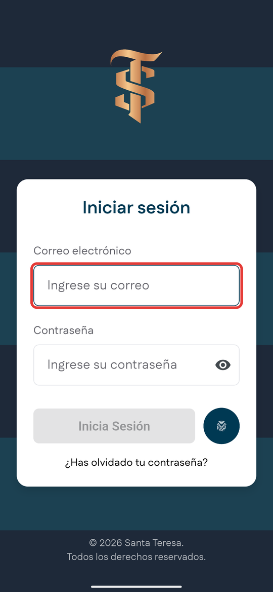
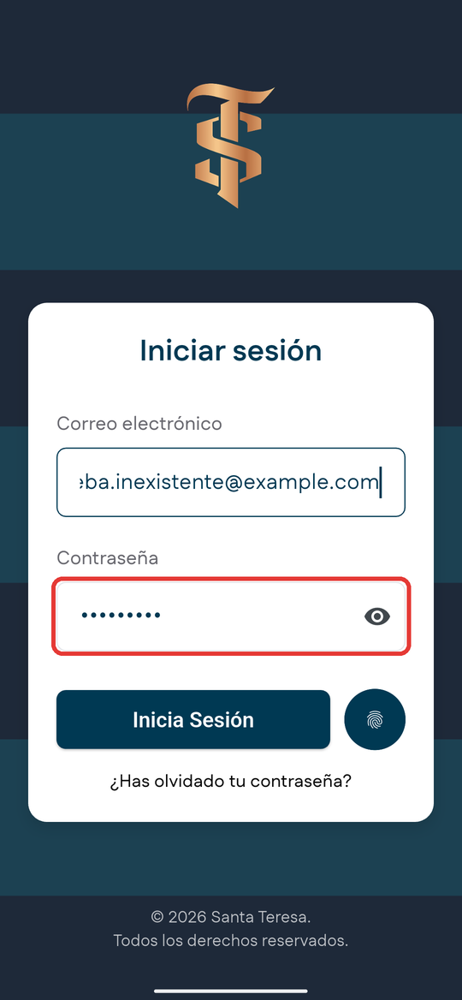
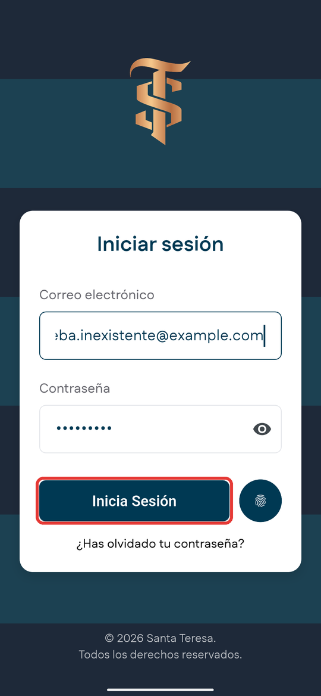
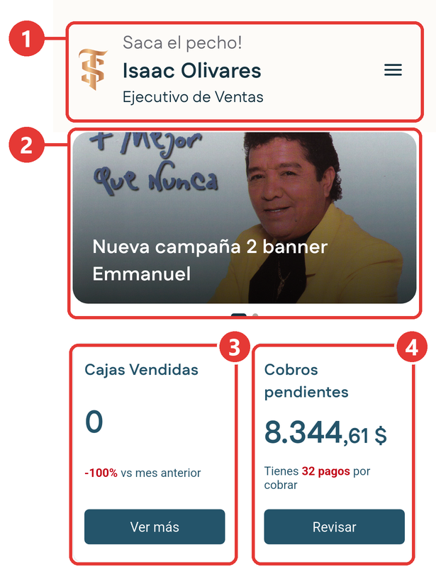
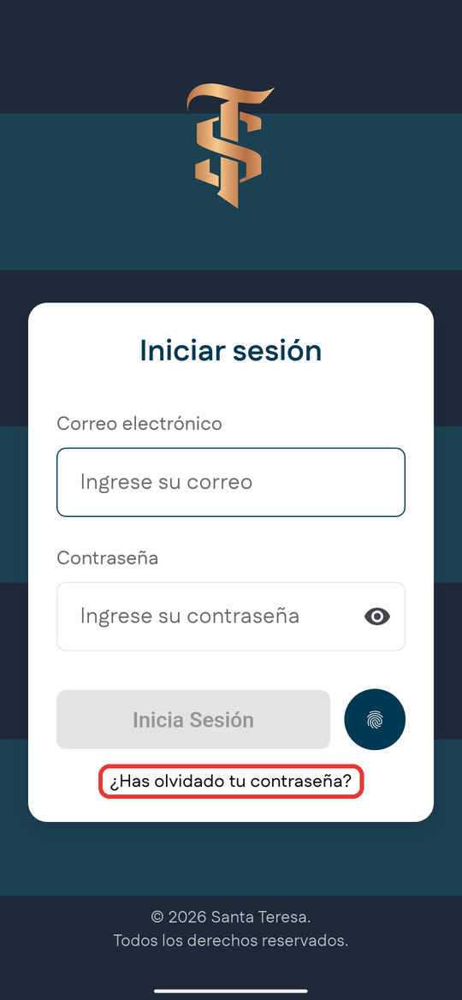
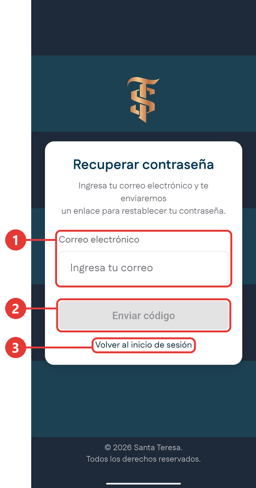

# Inicio de sesión

**Para qué sirve:** para entrar a la aplicación con tu correo electrónico y tu contraseña, y para salir de ella cuando lo necesites. Al entrar, la aplicación sabe quién eres y te muestra tu ruta, tus clientes y tu cuota.

Solo tienes que entrar una vez. Después, tu sesión queda abierta hasta que la cierres: cada vez que abres la aplicación, entras directo al Inicio.

## Qué necesitas antes de entrar

- El teléfono con la aplicación instalada.
- Tu **correo corporativo** y tu **contraseña**. Un administrador de la empresa te da acceso a la aplicación con el correo corporativo que ya tienes asignado.
- Conexión a internet la primera vez que entras, por datos móviles o por wifi. Después puedes abrir la aplicación aunque no tengas señal.

<!-- PENDIENTE P-01: nombre definitivo del ícono de la aplicación en el teléfono; hoy es provisional. Cuando exista, escribirlo en el paso 1 de "Entrar a la aplicación". -->

## Las partes de la pantalla

Es lo primero que ves al abrir la aplicación si no has entrado todavía. Arriba dice **Iniciar sesión**.

{ .captura }

| # | Qué es | Para qué sirve |
|:-:|---|---|
| 1 | **Correo electrónico** | Aquí escribes tu correo corporativo. |
| 2 | **Contraseña** | Aquí escribes tu contraseña. Lo que escribes se ve como puntos para que nadie lo lea. |
| 3 | **Ojo** | Muestra u oculta la contraseña que escribiste. |
| 4 | **Inicia Sesión** | Entra a la aplicación con los datos que escribiste. Se ve gris hasta que los dos campos están bien llenos. |
| 5 | **Huella** | Te permite entrar con tu huella, sin escribir el correo ni la contraseña. Puedes usarla después de entrar por primera vez con tu correo y tu contraseña. <!-- PENDIENTE P-03: confirmar si activar la huella será opcional, a elección del usuario. --> |
| 6 | **¿Has olvidado tu contraseña?** | Te ayuda a recuperar el acceso si no recuerdas tu contraseña. |

## Entrar a la aplicación

1. En el teléfono, toca el ícono de la aplicación para abrirla.

2. Toca el campo **Correo electrónico** y escribe tu correo corporativo completo, con la arroba y el dominio.

    { .captura }

3. Toca el campo **Contraseña** y escribe tu contraseña. Tiene por lo menos 8 caracteres.

    { .captura }

    !!! tip "Consejo"
        Si no estás seguro de lo que escribiste, toca el **ojo** para ver la contraseña antes de entrar. Hazlo donde nadie más pueda ver tu pantalla.

4. Cuando el botón **Inicia Sesión** cambia de gris a azul, tócalo.

    { .captura }

**Resultado esperado:** se abre el [Inicio](../modulos/inicio.md), con tu nombre y tu rol en la parte de arriba.

{ .captura }

## Si no puedes entrar

### El botón Inicia Sesión sigue gris

La aplicación no muestra ningún mensaje: solo deja el botón gris hasta que los datos están completos. Revisa lo siguiente:

1. Que los dos campos tengan algo escrito.
2. Que el correo esté completo, por ejemplo **nombre@empresa.com**, sin espacios.
3. Que la contraseña tenga 8 caracteres o más.

### El correo o la contraseña no son correctos

Si tocas **Inicia Sesión** y los datos no coinciden, aparece abajo, en una franja roja, un aviso que indica que el correo o la contraseña no son correctos.

<!-- PENDIENTE-IMAGEN P-19: error-credenciales.png | Tomarla cuando el aviso salga en español; hoy dice "Invalid credentials". | Pantalla de inicio de sesión con un correo inventado y el aviso rojo de correo o contraseña incorrectos, ya con el texto definitivo en español -->

1. Revisa que tu correo esté bien escrito, sin espacios al principio ni al final.
2. Toca el **ojo** para ver la contraseña que escribiste y revísala con calma.
3. Fíjate en las mayúsculas y las minúsculas. Para la aplicación, una **A** y una **a** son distintas.
4. Vuelve a tocar **Inicia Sesión**.

!!! tip "Consejo"
    Tu cuenta no se bloquea si te equivocas varias veces. Aun así, si no recuerdas tu contraseña, no sigas probando al azar: usa la opción para recuperarla.

### Olvidaste tu contraseña

1. En la pantalla de inicio de sesión, toca **¿Has olvidado tu contraseña?**.

    { .captura }

2. Se abre la pantalla **Recuperar contraseña**. Escribe tu correo en el campo **Correo electrónico** y toca **Enviar código**.

    { .captura }

    | # | Qué es | Para qué sirve |
    |:-:|---|---|
    | 1 | **Correo electrónico** | Aquí escribes el correo con el que entras a la aplicación. |
    | 2 | **Enviar código** | Envía un código a tu correo corporativo para que crees una contraseña nueva. Se ve gris hasta que escribes un correo completo. |
    | 3 | **Volver al inicio de sesión** | Te regresa a la pantalla de inicio de sesión sin enviar nada. |

    Si el correo no está bien escrito o no corresponde a una cuenta, aparece un aviso rojo debajo del campo. Revísalo y vuelve a intentarlo.

3. Revisa tu correo corporativo: te llega un código. Escríbelo en la aplicación y crea tu contraseña nueva.

    <!-- PENDIENTE-IMAGEN P-16: olvido-paso-3.png | Tomarla con la cuenta de P-17. | Pantalla donde se escribe el código que llega al correo, con recuadro rojo sobre el campo del código -->

4. Vuelve a la aplicación y entra con tu contraseña nueva.

Si el código no te llega en unos minutos, revisa la carpeta de correo no deseado. Si no tienes acceso a tu correo corporativo, comunícate con el equipo de Santa Teresa.

### No tienes conexión

Solo necesitas conexión la primera vez que entras, porque la aplicación tiene que comprobar tu correo y tu contraseña. Si en ese momento el teléfono no tiene señal, no puedes entrar.

<!-- PENDIENTE P-22: texto exacto del aviso que muestra la aplicación al intentar entrar sin conexión. Escribirlo en el párrafo anterior, en negrita. -->
<!-- PENDIENTE-IMAGEN P-22: error-sin-conexion.png | Tomarla con el texto que confirme P-22 y con los mensajes ya en español de P-19. | Pantalla de inicio de sesión mostrando el aviso de falta de conexión, con recuadro rojo sobre el aviso -->

1. Revisa que el teléfono tenga los datos móviles o el wifi encendidos.
2. Revisa que el **modo avión** esté apagado.
3. Si estás en un lugar con poca señal, muévete a un sitio con mejor cobertura.
4. Vuelve a tocar **Inicia Sesión**.

!!! tip "Consejo"
    Cuando ya estás dentro, puedes seguir trabajando aunque se caiga la señal. Lee [Trabajar sin conexión](antes-de-empezar.md#trabajar-sin-conexion) para saber qué funciona sin señal.

### Sigues sin poder entrar

Si probaste todo lo anterior y la aplicación no te deja entrar, comunícate con tu supervisor. Explícale qué aviso te aparece en la pantalla; si puedes, envíale una foto de ese aviso.

## Cerrar sesión

Cerrar sesión hace que la aplicación deje de estar abierta con tu cuenta. Para volver a entrar, tendrás que escribir otra vez tu contraseña.

Hazlo cuando:

- Vas a prestar o devolver un teléfono que no es tuyo.
- Vas a cambiar de teléfono.
- Otra persona va a usar la aplicación en ese mismo teléfono.

!!! warning "Antes de cerrar sesión"
    La sesión se cierra apenas tocas el botón, sin preguntarte nada. Antes de cerrarla, ubícate en un lugar con señal para que se envíe todo lo que registraste, y sigue los pasos de [Cerrar la jornada con todo enviado](antes-de-empezar.md#cerrar-la-jornada-con-todo-enviado).

<!-- PENDIENTE P-09: confirmar en prueba qué pasa con lo guardado sin conexión si se cierra sesión antes de enviarlo. Lo esperado es que se envíe apenas haya señal. Ajustar el aviso "Antes de cerrar sesión" con ese dato. Ojo con P-08: hoy cerrar sesión no cierra la sesión de verdad, ver BUG-001. -->

### Desde el menú lateral

1. En el Inicio, toca el botón de **tres líneas** que está arriba a la derecha para abrir el [menú lateral](navegacion.md#el-menu-lateral).

2. Toca **Cerrar sesión**, al final del menú, en rojo.

    { .captura }

    En la captura, **Cerrar sesión** es el recuadro 3.

**Resultado esperado:** la aplicación vuelve a la pantalla de inicio de sesión. Tu correo queda escrito en el campo **Correo electrónico** y solo falta la contraseña.

### Desde Configuración

También puedes cerrar sesión desde [Configuración](../modulos/configuracion.md#cerrar-sesion): abre **Configuración**, desliza el dedo hacia arriba y toca **Cerrar Sesión**, al final de la pantalla.

## Consejos de seguridad

Todo lo que haces en la aplicación queda registrado a tu nombre: pedidos, cobros, clientes nuevos y solicitudes. Cuidar tu contraseña es cuidar tu trabajo.

!!! warning "Tu contraseña es solo tuya"
    No se la des a nadie, ni a un compañero, ni a un cliente. Si alguien te la pide por teléfono o por mensaje, no la entregues y avisa a tu supervisor.

- **No la anotes** en papeles, en la funda del teléfono ni en notas que otros puedan ver.
- **Cierra sesión** cada vez que uses la aplicación en un teléfono que no es el tuyo.
- **Ponle bloqueo de pantalla a tu teléfono**, con un código, un patrón o tu huella. Así, si lo pierdes, nadie puede entrar a la aplicación con tu cuenta.
- **Cambia tu contraseña** si crees que alguien la conoce. Puedes hacerlo desde tu perfil, dentro de la aplicación.
- **Si pierdes el teléfono**, avisa de inmediato a tu supervisor.

<!-- PENDIENTE P-07: pasos exactos para cambiar la contraseña desde el perfil y su captura. Agregarlos como una sección corta o enlazar a Configuración. -->

## A dónde puedes ir desde aquí

| Si quieres | Ve a |
|---|---|
| Entender lo que ves apenas entras | [Inicio](../modulos/inicio.md) |
| Aprender a llegar a cada módulo | [Cómo moverte por la aplicación](navegacion.md) |
| Saber qué puedes hacer sin señal | [Trabajar sin conexión](antes-de-empezar.md#trabajar-sin-conexion) |
