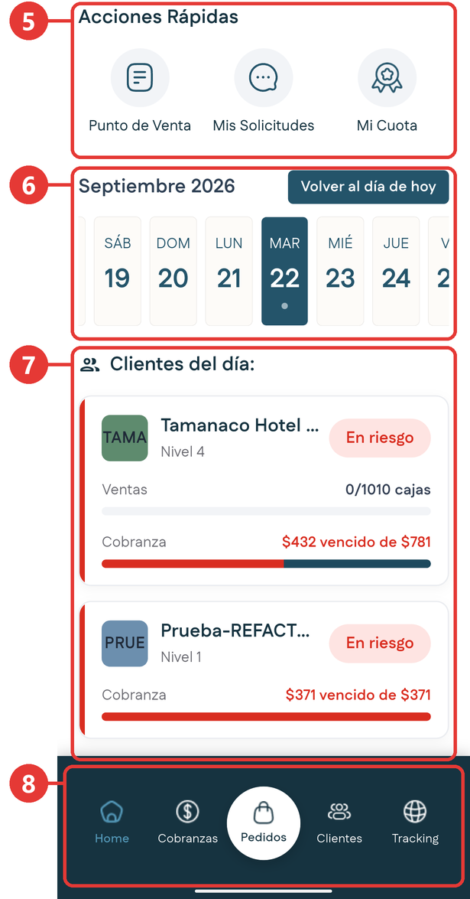
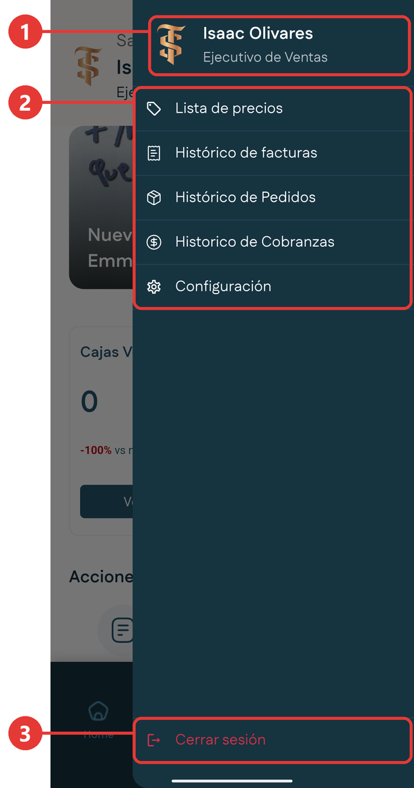

# Cómo moverte por la aplicación

Hay tres formas de llegar a los módulos. Conviene conocerlas desde el principio.

| Acceso | Dónde está | Qué contiene |
|---|---|---|
| **Barra inferior** | Fija en la parte de abajo de la pantalla. | Home, Cobranzas, Pedidos, Clientes y Tracking. |
| **Acciones Rápidas** | En el Inicio, debajo de las tarjetas de resumen. | Punto de Venta, Mis Solicitudes y Mi Cuota. |
| **Menú lateral** | Botón de tres líneas, arriba a la derecha del Inicio. | Lista de precios, históricos, Configuración y Cerrar sesión. |

## La barra inferior

Está visible en casi todas las pantallas. La opción en la que estás aparece resaltada en azul claro.

{ .captura }

La barra inferior es el recuadro 8 de la captura.

## Las Acciones Rápidas

Son tres accesos directos que aparecen en el Inicio: **Punto de Venta**, **Mis Solicitudes** y **Mi Cuota**. En la captura de arriba son el recuadro 5.

## El menú lateral

Aquí están las consultas de referencia y la configuración de tu cuenta. Desde el menú no se crea nada: sirve para buscar información que ya existe.

{ .captura }

| # | Qué es |
|:-:|---|
| 1 | Tu nombre y tu rol. |
| 2 | Las opciones: **Lista de precios**, **Histórico de facturas**, **Histórico de Pedidos**, **Histórico de Cobranzas** y **Configuración**. |
| 3 | **Cerrar sesión**, al final del menú, en rojo. |

### Abrir el menú lateral

1. En el Inicio, toca el botón de **tres líneas** que está arriba a la derecha, a la altura de tu nombre.
2. El menú aparece desde la derecha.
3. Toca la opción que necesites.
4. Para cerrarlo sin elegir nada, toca fuera del menú.

## Volver a la pantalla anterior

En la parte de arriba de cada pantalla hay una **flecha hacia la izquierda**. Tócala para regresar a la pantalla anterior.
